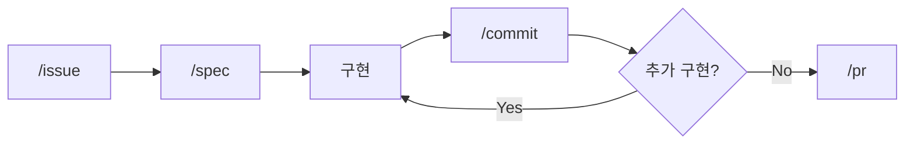
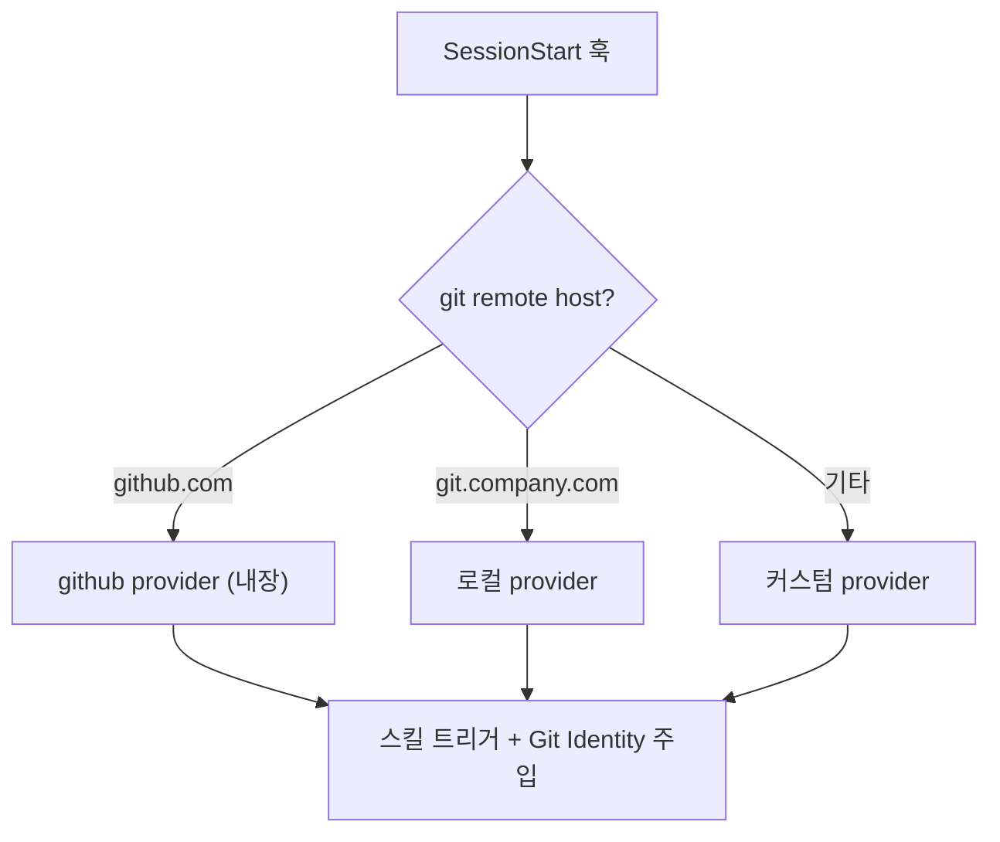

# claude-devex

Claude Code 플러그인 — AI-Native Development Workflow

> 자연어로 요청하면 이슈 생성부터 PR 머지까지 전체 플로우를 안내합니다.
> Provider 시스템으로 GitHub 등 다양한 이슈 트래커에 대응합니다.

## 배경

AI에게 코드를 맡기면서 개발자의 역할이 "코드 작성"에서 "의사결정과 검증"으로 옮겨갔습니다.
이 플러그인은 그 변화를 워크플로우로 정착시키기 위해 시작되었습니다.

- [AI에게 코드를 맡기고 나서 달라진 일하는 방식](https://idean3885.github.io/posts/ai-changed-my-workflow/) — 이슈 플로우의 배경
- [코드에서 사고로](https://idean3885.github.io/posts/from-coding-to-thinking/) — thinking 스킬의 배경

## 이슈 플로우



`/flow` 스킬로 전체 플로우를 오케스트레이션할 수 있습니다.
3개의 확인 게이트(플랜 승인, 커밋 승인, 머지 승인)에서 사용자 승인을 받은 후 진행합니다.

| 스킬 | 역할 | 트리거 |
|------|------|--------|
| `/flow` | 이슈 플로우 전체 오케스트레이션 | "flow", "플로우", 자연어 수정 요청 |
| `/issue` | 이슈 생애주기 (create/start/complete) | "이슈", "issue" |
| `/spec` | 요구사항 분석, 아키텍처 설계 | "spec", "명세" |
| `/commit` | 커밋 리뷰 + Git Identity 검증 + 커밋 | "commit", "커밋" |
| `/pr` | PR 생성 + 머지 | "PR", "풀리퀘" |
| `/setup` | provider 등록, 상태 확인 | "setup", "설정" |

## Provider 시스템

이슈 트래커별 동작을 provider로 추상화합니다.
SessionStart 훅에서 git remote host 기반으로 자동 감지됩니다.



| 위치 | 용도 |
|------|------|
| `providers/github.md` | 기본 내장 provider (GitHub) |
| `providers/PROVIDER.md` | 커스텀 provider 작성 템플릿 |
| `~/.claude/devex/providers/` | 로컬 전용 커스텀 provider |
| `~/.claude/devex/overlays/` | host별 오버레이 설정 |

## Git Identity

Provider별 Git Identity(user.name, user.email)를 정의하여,
커밋/푸시 시 올바른 계정으로 자동 설정합니다.

- SessionStart 훅에서 `gh auth status` 크리덴셜과 provider identity를 매칭
- 커밋 전 `git config user.name/email`을 provider 기준으로 자동 검증 및 수정
- 글로벌 git config에 의존하지 않아 계정 오류를 원천 차단

## Thinking 스킬

의사결정과 검증을 구조화하는 사고 도구입니다.
이슈 플로우와 독립적으로 사용하거나 연계할 수 있습니다.

| 스킬 | 역할 | 자연어 예시 |
|------|------|------------|
| `/decision-record` | 아키텍처 의사결정 기록 (MADR 기반, 파기 조건 포함) | "이 결정 기록해줘" |
| `/verify` | 3-Layer 정합성 검증 (Philosophy → Strategy → Tactics) | "이 설계 검증해줘" |
| `/dependency-map` | 의존성 맵 생성, 변경 영향도 분석 (Mermaid) | "의존성 분석해줘" |

## Usage Tracking

ticket 단위로 토큰·비용을 추적하는 스킬 묶음입니다. worktree-per-task 환경에서 정확히 분리됩니다.

| 스킬 | 역할 |
|------|------|
| `/usage-start` | 추적 시작. cwd / project / branch 기록 |
| `/usage-checkpoint` | 단계 표시 (구현 → 검증 등 구간 분리) |
| `/usage-snap` | 현재 누적 스냅샷 |
| `/usage-complete` | 완료 처리 + 리포트 저장 |
| `/usage-report` | 모든 task 비교 대시보드 |

worktree-per-task 환경에서 ticket 단위 분리가 동작하는 원리·알고리즘은 [docs/usage-cwd-aggregation.md](docs/usage-cwd-aggregation.md) 참조.

## 스타일 룰 (Style Rules)

블로그·위키·이슈·PoC·데일리로그·동료리뷰·성과평가 등 **모든 한국어 문서**에 적용되는 작성 SSOT 를 제공합니다.
base(공통) + extensions(유형별 추가 규칙) 구조로, 작성 빈도와 함께 점진 보강합니다.

### 구조

```
config/style-rules/
├── base/
│   ├── ai-tells.md       # AI 티 분류 (A~J 10대 카테고리, S1/S2/S3)
│   ├── readability.md    # 구조 가독성 (P/H/L/C/V/K/B)
│   ├── tone.md           # 저자 톤 (T1~T13)
│   └── punctuation.md    # 한국어 구두점 (PN1~PN5)
└── extensions/
    ├── blog.md           # 블로그 (PAAR, 포트폴리오 어필)
    ├── wiki.md           # 사내 위키 (시리즈 인덱스, 상세도)
    ├── poc.md            # PoC (결론 선행, 재현 가능성)
    ├── info.md           # 정보성 (따라하기 용이성)
    ├── knowledge.md      # 개발 사전 (저자 실무 판단)
    ├── issue.md          # 이슈 (재현 절차) — 골격
    ├── dailylog.md       # 데일리로그 — 골격
    ├── peer-review.md    # 동료리뷰 — 골격
    └── work-review.md    # 성과평가 — 골격
```

### AI 티 분류 (im-not-ai 차용)

`base/ai-tells.md`의 10대 카테고리 골격(A 번역투 / B 영어 인용 / C 구조적 AI 패턴 / D AI 관용구 / E 리듬 균일성 / F 수식·중복 / G Hedging / H 접속사 / I 형식명사 / J 시각 장식)과 심각도(S1/S2/S3) 체계는 [`epoko77-ai/im-not-ai`](https://github.com/epoko77-ai/im-not-ai) (MIT) 의 한국어 humanize 스킬에서 차용했습니다. 처방·예시·forbidden-words hook 매핑은 한국어 기술 블로그 맥락으로 자체 작성한 파생물입니다.

### 표현 가드 hook (사전 가이드 + 사후 통지)

금지 표현(과장형 형용사·보고서체·근거 없는 단언 등)을 응답 출력 직전에 막거나 재작성하지는 않습니다. 대신 두 단계로 동작합니다. UserPromptSubmit hook이 금지 표현 룰을 system-reminder로 사전 주입하고, Stop hook이 직전 응답을 정규식 매칭해 위반을 기록한 뒤 다음 턴 사용자에게 통지합니다.

따라서 출력 직전 패턴 자가 대조는 어시스턴트의 의무이며, hook은 이를 돕는 사전 가이드와 사후 통지 역할입니다. `base/ai-tells.md`의 S1 패턴 중 즉시 교정 가치가 있는 룰이 등록되어 있습니다.

| 위치 | 역할 |
|------|------|
| [`config/forbidden-words.json`](config/forbidden-words.json) | 기본 룰 (표현 가드 패턴) |
| `~/.claude/forbidden-words.local.json` | 사용자 추가 룰 (선택, 머지됨) |

룰 추가는 JSON에 `{pattern, replacement, reason}` 객체 하나만 추가하면 즉시 반영됩니다. 패턴은 Python 정규식 문법.
신규 패턴은 먼저 `base/ai-tells.md` 분류 체계에 카테고리 ID 부여 후 S1 으로 판정될 때 등록합니다.

### 사용자 스코프 미러

SessionStart hook에서 `config/style-rules/` 의 base·extensions 를 `~/.claude/devex/style-rules/` 로 미러링합니다.
toolkit 등 외부 소비자(예: `toolkit:content-write`, `toolkit:wiki-publish`)는 이 경로를 참조합니다.
사용자 로컬 추가 룰(`*.local.md`, `*.local.json`)은 미러 시 덮어쓰지 않습니다.

## 설치

Claude Code 플러그인 마켓플레이스에서 설치합니다.

```bash
claude plugins add devex@claude-devex --marketplace claude-devex
```

> 마켓플레이스 등록이 필요한 경우:
> ```bash
> claude plugins marketplace add claude-devex --source git --url https://github.com/idean3885/claude-devex.git
> ```

### 플러그인 자체 관리

| 기능 | 동작 |
|------|------|
| git 자동 복원 | SessionStart 훅에서 `.git` 없으면 자동 init + fetch |
| 버전 자동 동기화 | VERSION 파일 ↔ 캐시 디렉토리명 불일치 시 자동 리네임 + installed_plugins.json 갱신 |
| git identity 자동 설정 | 플러그인 리모트 호스트의 provider identity로 자동 설정 |
| 구버전 정리 | 캐시 내 이전 버전 디렉토리 자동 삭제 |

### 로컬 개발

캐시 디렉토리에서 직접 수정 → 커밋 → 푸시.
다음 세션 시작 시 버전 동기화가 자동 수행됩니다.

```bash
cd ~/.claude/plugins/cache/claude-devex/devex/{version}/
# 수정 → git add → git commit → git push origin master:main
```

## 파일 구조

```
claude-devex/
├── README.md                        # 이 파일
├── CLAUDE.md                        # AI 협업 가이드 (범용 템플릿)
├── VERSION                          # 현재 버전 (semver)
├── CHANGELOG.md                     # 변경 이력
├── .claude-plugin/
│   ├── plugin.json                  # 플러그인 메타데이터
│   └── marketplace.json             # 마켓플레이스 등록 정보
├── hooks/
│   ├── hooks.json                   # 훅 등록 (SessionStart / PreToolUse / UserPromptSubmit / Stop)
│   ├── forbidden-words-prompt.sh    # UserPromptSubmit — 금지 표현 룰 주입
│   └── forbidden-words-stop.sh      # Stop — 직전 응답 위반 검출
├── config/
│   ├── forbidden-words.json         # 표현 가드 룰 (사전 가이드 + 사후 통지)
│   └── style-rules/
│       ├── base/                    # 모든 문서 공통 SSOT
│       │   ├── ai-tells.md          # AI 티 분류 (im-not-ai 차용, MIT)
│       │   ├── readability.md       # 구조 가독성
│       │   ├── tone.md              # 저자 톤
│       │   └── punctuation.md       # 한국어 구두점
│       └── extensions/              # 문서 유형별 추가 규칙
│           ├── blog.md
│           ├── wiki.md
│           ├── poc.md
│           ├── info.md
│           ├── knowledge.md
│           ├── issue.md
│           ├── dailylog.md
│           ├── peer-review.md
│           └── work-review.md
├── scripts/
│   └── session-start.mjs            # provider 감지, Git Identity, 버전·SSOT 동기화
├── providers/
│   ├── PROVIDER.md                  # 커스텀 provider 템플릿
│   └── github.md                    # GitHub 기본 내장 provider
└── skills/
    ├── issue/SKILL.md               # /issue
    ├── spec/SKILL.md                # /spec
    ├── commit/SKILL.md              # /commit
    ├── pr/SKILL.md                  # /pr
    ├── flow/SKILL.md                # /flow
    ├── setup/SKILL.md               # /setup
    └── thinking/
        ├── decision-record/SKILL.md # /decision-record
        ├── verify/SKILL.md          # /verify
        └── dependency-map/SKILL.md  # /dependency-map
```

## 요구사항

- [Claude Code CLI](https://docs.anthropic.com/en/docs/claude-code)
- [GitHub CLI](https://cli.github.com/) (`gh`)

## 라이선스

MIT

### 차용한 외부 자원

- [`epoko77-ai/im-not-ai`](https://github.com/epoko77-ai/im-not-ai) (MIT) — `config/style-rules/base/ai-tells.md` 의 10대 분류 골격(A~J)과 심각도(S1/S2/S3) 체계. 처방·예시·hook 매핑은 자체 작성.
