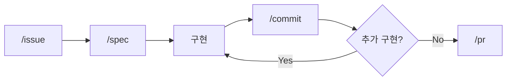

# claude-devex

이슈 플로우, 콘텐츠 작성·검증, 규칙 자동 적용을 하나로 묶은 개인용 Claude Code 플러그인입니다.

> 자주 쓰는 워크플로우와 작성 규칙을 세션 시작·파일 편집·응답 시점에 자동으로 걸리도록 환경에 넣어 둡니다.

## 무엇을 주나

AI 에게 코드·문서를 맡기며 반복되는 지시와 교정을 세 축으로 묶어 환경에 고정했습니다.

| 축 | 구성 | 역할 |
|----|------|------|
| **이슈·멀티레포 플로우** | `flow`, `org-flow`, `setup`, provider 시스템 | 자연어 수정 요청을 issue → spec → 구현 → commit → PR 로. 여러 레포에 걸친 변경은 org-flow 로 조율 |
| **콘텐츠 작성·검증** | `content-write/verify/publish`, `cross-verify`, 스타일 SSOT | 한국어 문서 작성 → AI 티·가독성·톤 검증 → 발행 |
| **규칙 자동 적용** | SessionStart · hook · 스킬 트리거 | 작성 원칙·워크플로우 규칙을 사람 기억이 아니라 환경에 고정 |

보조로 ticket 단위 토큰·비용 추적(Usage Tracking)을 제공합니다. 왜 규칙을 환경에 넣는지, 어떤 판단을 거쳤는지는 [docs/design-philosophy.md](docs/design-philosophy.md) 에 적었습니다.

- [AI에게 코드를 맡기고 나서 달라진 일하는 방식](https://idean3885.github.io/posts/ai-changed-my-workflow/): 이슈 플로우의 배경
- [코드에서 사고로](https://idean3885.github.io/posts/from-coding-to-thinking/): 검증·사고 도구의 배경

## 빠른 시작

```bash
claude plugins marketplace add claude-devex --source git --url https://github.com/idean3885/claude-devex.git
claude plugins add devex@claude-devex --marketplace claude-devex
```

스킬을 직접 호출하지 않아도 됩니다. 자연어로 요청하면 트리거 키워드로 자동 라우팅됩니다.

## 1. 이슈·멀티레포 플로우



`flow` 하나가 git 상태를 감지해 현재 단계를 실행하고, 3개 게이트(플랜·커밋·머지)에서 사용자 승인을 받은 뒤 진행합니다.

| 스킬 | 역할 | 트리거 |
|------|------|--------|
| `/flow` | 이슈 플로우 단일 진입점 (issue → spec → 구현 → commit → pr) | "flow", "플로우", 자연어 수정 요청 |
| `/org-flow` | 멀티레포 오케스트레이션 + 사내/퍼블릭 provider 분기 | "org-flow", "멀티레포" |
| `/setup` | provider 등록, 상태 확인, overlay 설정 | "setup", "설정" |

- **org-flow**: 여러 레포에 걸친 변경에서 통일 브랜치명·레포별 provider·Git Identity·워크트리를 한 흐름으로 맞춥니다.
- **provider 시스템**: 이슈 트래커별 동작을 추상화하고 SessionStart 훅이 git remote host 로 자동 감지합니다. provider별 Git Identity 를 커밋 전 자동 검증·수정해, 글로벌 git config 에 의존한 계정 오류를 막습니다.

## 2. 콘텐츠 작성·검증

블로그·위키·이슈·PoC 등 한국어 문서를 작성하고 검증하는 흐름입니다.

| 스킬 | 역할 | 트리거 |
|------|------|--------|
| `/content-write` | 범용 작성 엔진 (성격 파악·시리즈 구조·인라인 검증) | "콘텐츠 작성", "글 작성" |
| `/content-verify` | 검증 (사실·구조·독립가치 + 가독성·톤·구두점·AI 티) | "검증", "가독성 검사" |
| `/content-publish` | 발행 (수집 → 비평가 검토 → Jekyll 변환 → 커밋) | "블로그 발행", "publish" |
| `/cross-verify` | 교차 검증 (의사결정·설계·문서·구현 4축) | "교차 검증" |

- **cross-verify**: 자동화가 아니라 개발자가 의도적으로 멈추고 확인하는 행위를 구조화한 것입니다. 도구가 측정 못 하는 의미적 판단에 집중합니다.
- **스타일 룰(SSOT)**: 모든 한국어 문서에 적용되는 작성 단일 출처입니다. base(공통) + extensions(유형별) 구조로, SessionStart hook 이 `~/.claude/devex/style-rules/` 로 미러링해 외부 소비자가 참조합니다. AI 티 분류는 [`epoko77-ai/im-not-ai`](https://github.com/epoko77-ai/im-not-ai)(MIT) 의 골격을 차용했습니다.

```
config/style-rules/
├── base/         # ai-tells · readability · tone · punctuation
└── extensions/   # blog · wiki · poc · issue · dailylog · peer-review · work-review …
```

## 3. 규칙 자동 적용

작성 원칙과 워크플로우 규칙을 세 시점에 겁니다. 시점마다 막는 실수가 다릅니다. 설계 배경은 [docs/design-philosophy.md](docs/design-philosophy.md) 를 참조하세요.

| hook | 시점 | 동작 |
|------|------|------|
| `forbidden-words-prompt.sh` | UserPromptSubmit | 금지 표현 룰을 사전 주입 |
| `forbidden-words-stop.sh` | Stop | 직전 응답 위반을 다음 턴에 통지 |
| `content-verify-posttool.sh` | PostToolUse(Edit/Write) | 문서 편집 후 자가 점검 유도 (opt-in) |
| `pre-tool-use.mjs` | PreToolUse | 퍼블릭 표면으로 가는 대외비 키워드 하드 차단 |

표현 가드는 응답을 막거나 자동으로 고쳐 쓰지 않고, 사전 주입 + 사후 통지로 동작합니다. 출력 직전 자가 대조는 어시스턴트의 몫입니다. 룰 포맷·마커 스키마 등 설정 상세는 [docs/hooks-config.md](docs/hooks-config.md).

## Usage Tracking

ticket 단위로 토큰·비용을 추적합니다. worktree-per-task 환경에서 정확히 분리됩니다. `/usage-start · checkpoint · snap · complete · report` 5종을 제공하며, 집계 원리는 [docs/usage-cwd-aggregation.md](docs/usage-cwd-aggregation.md) 를 참조하세요.

## 로컬 개발

변경은 워크트리에서 작업하고 PR 로 머지합니다. main 직접 push 는 하지 않습니다.

```bash
git worktree add ../claude-devex-{타입}-{번호} -b {타입}/{번호} origin/main
./scripts/bump-version.sh <version> "<변경 설명>"   # VERSION·CHANGELOG·plugin.json·marketplace.json 동시 갱신
# 커밋 → 브랜치 push → PR → 웹 머지
./scripts/post-merge-sync.sh                        # 머지 후 로컬 캐시 동기
```

## 요구사항

- [Claude Code CLI](https://docs.anthropic.com/en/docs/claude-code)
- [GitHub CLI](https://cli.github.com/) (`gh`)

## 라이선스

MIT. AI 티 분류는 [`epoko77-ai/im-not-ai`](https://github.com/epoko77-ai/im-not-ai)(MIT) 의 10대 분류 골격(A~J)·심각도(S1/S2/S3) 체계를 차용했고, 처방·예시·hook 매핑은 한국어 기술 문서 맥락으로 자체 작성했습니다.
