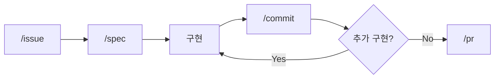
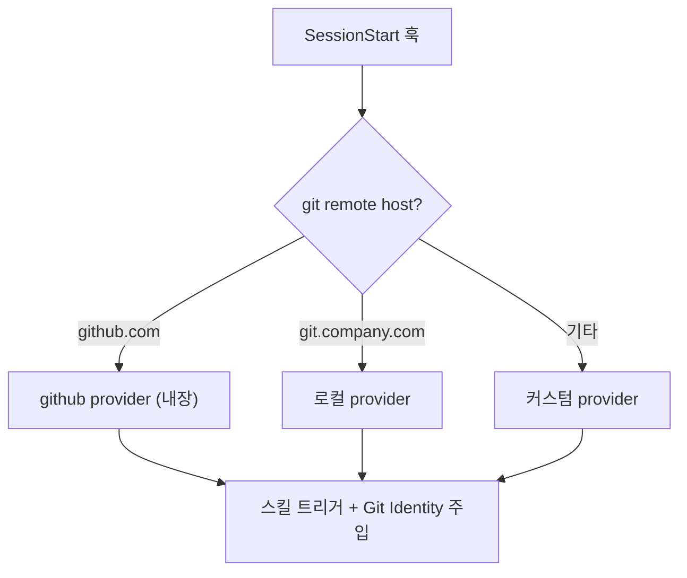

# claude-devex

이슈 플로우·콘텐츠 작성·교차 검증을 하나로 묶은 개인 개발 어시스턴트 (Claude Code 플러그인)

> 자연어 요청을 워크플로우로 라우팅하고,
> 작성 원칙과 워크플로우 규칙을 하네스(SessionStart·hook·스킬)에 주입해 매번 같은 출발선에서 동작시킵니다.

## 배경

AI 에게 코드를 맡기면서 개발자의 역할이 "코드 작성"에서 "의사결정과 검증"으로 옮겨갔습니다.

문제는 AI 가 매번 같게 동작하지 않는다는 점입니다. 톤이 흔들리고, 규칙을 잊고, 묻지 않은 수식어를 붙입니다. 그래서 규칙을 기억에 의존하지 않고 하네스에 심어, 매 세션·매 편집·매 응답에 자동으로 걸리게 만듭니다. 이것이 이 플러그인이 AI 를 대하는 방식입니다.

설계 의도와 주입 메커니즘의 상세는 [docs/design-philosophy.md](docs/design-philosophy.md) 에 정리했습니다.

- [AI에게 코드를 맡기고 나서 달라진 일하는 방식](https://idean3885.github.io/posts/ai-changed-my-workflow/): 이슈 플로우의 배경
- [코드에서 사고로](https://idean3885.github.io/posts/from-coding-to-thinking/): 검증·사고 도구의 배경

## 어시스턴트 구성

세 축으로 묶입니다. 앞의 두 축이 "무엇을 하는가"이고, 세 번째 축이 "어떻게 매번 같게 동작시키는가"입니다.

| 축 | 구성요소 | 역할 |
|----|----------|------|
| **이슈 플로우** | `flow`, `org-flow`, `setup`, provider 시스템 | 자연어 수정 요청 → 이슈 → spec → 구현 → commit → PR |
| **콘텐츠 작성·검증** | `content-write`, `content-verify`, `content-publish`, `cross-verify`, 스타일 SSOT | 작성 → 검증 → 발행, 그리고 의도적 멈춤(교차 검증) |
| **사상 주입 하네스** | SessionStart, hook(표현 가드·content-verify·대외비), 스킬 트리거 | 작성 원칙·워크플로우 규칙을 환경에 고정 |

보조로 ticket 단위 토큰·비용 추적([Usage Tracking](#usage-tracking))을 제공합니다.

---

## 1. 이슈 플로우



`flow` 스킬 하나가 전체 플로우를 오케스트레이션합니다. 자연어로 수정을 요청하면 git 상태를 감지해 현재 단계에 맞는 작업을 실행하고, 3개의 확인 게이트(플랜 승인, 커밋 승인, 머지 승인)에서 사용자 승인을 받은 후 진행합니다.

| 스킬 | 역할 | 트리거 |
|------|------|--------|
| `/flow` | 이슈 플로우 단일 진입점 (issue → spec → 구현 → commit → pr) | "flow", "플로우", 자연어 수정 요청 |
| `/org-flow` | 멀티레포 오케스트레이션 + 사내/퍼블릭 provider 분기 | "org-flow", "멀티레포" |
| `/setup` | provider 등록, 상태 확인, overlay 설정 | "setup", "설정" |

issue / spec / commit / pr 단계의 상세 가이드는 `flow` 스킬 내부의 `guides/` 로 통합되어 있습니다. 단계 진입 시에만 로딩되어 컨텍스트를 아낍니다.

### Provider 시스템

이슈 트래커별 동작을 provider 로 추상화합니다. SessionStart 훅에서 git remote host 기반으로 자동 감지됩니다.



| 위치 | 용도 |
|------|------|
| `providers/github.md` | 기본 내장 provider (GitHub) |
| `providers/PROVIDER.md` | 커스텀 provider 작성 템플릿 |
| `~/.claude/devex/providers/` | 로컬 전용 커스텀 provider |
| `~/.claude/devex/overlays/` | host별 오버레이 설정 |

### Git Identity

Provider별 Git Identity(user.name, user.email)를 정의해, 커밋/푸시 시 올바른 계정으로 자동 설정합니다.

- SessionStart 훅에서 `gh auth status` 크리덴셜과 provider identity 를 매칭합니다.
- 커밋 전 `git config user.name/email` 을 provider 기준으로 자동 검증·수정합니다.
- 글로벌 git config 에 의존하지 않아 계정 오류를 원천 차단합니다.

---

## 2. 콘텐츠 작성·검증

블로그·위키·이슈·PoC 등 한국어 문서를 작성하고 검증하는 흐름입니다. 작성 엔진이 초안을 만들고, 검증이 AI 티·가독성·톤을 점검하고, 발행이 Jekyll 로 변환합니다.

| 스킬 | 역할 | 트리거 |
|------|------|--------|
| `/content-write` | 범용 콘텐츠 작성 엔진 (문서 성격 파악, 시리즈 구조, 인라인 검증) | "콘텐츠 작성", "글 작성" |
| `/content-verify` | 마크다운 검증 (사실·구조·독립가치 + 가독성·톤·구두점·AI 티) | "검증", "가독성 검사" |
| `/content-publish` | 블로그 발행 (수집 → 비평가 검토 → Jekyll 변환 → 커밋) | "블로그 발행", "publish" |
| `/cross-verify` | 교차 검증 (의사결정·설계·문서·구현 4축) | "교차 검증", "크로스 체크" |

### 교차 검증 (cross-verify)

자동화가 아니라, **개발자가 의도적으로 멈추고 확인하는 행위를 구조화한 것**입니다. 도구가 측정할 수 없는 의미적 판단에 집중합니다. `config/cross-verify/profiles/` 의 프로젝트별 프로필을 자동 매칭하며, 프로필이 없으면 범용 4축 검증을 실행합니다.

### 스타일 룰 (Style Rules): 작성 SSOT

블로그·위키·이슈·PoC·데일리로그·동료리뷰·성과평가 등 **모든 한국어 문서**에 적용되는 작성 단일 출처입니다. base(공통) + extensions(유형별) 구조로, 작성 빈도와 함께 점진 보강합니다.

```
config/style-rules/
├── base/
│   ├── ai-tells.md       # AI 티 분류 (A~J 10대 카테고리, S1/S2/S3)
│   ├── readability.md    # 구조 가독성 (P/H/L/C/V/K/B)
│   ├── tone.md           # 저자 톤 (T1~T13)
│   └── punctuation.md    # 한국어 구두점 (PN1~PN5)
└── extensions/
    ├── blog.md  wiki.md  poc.md  info.md  knowledge.md
    └── issue.md  dailylog.md  peer-review.md  work-review.md
```

**AI 티 분류**는 [`epoko77-ai/im-not-ai`](https://github.com/epoko77-ai/im-not-ai) (MIT) 의 10대 분류 골격(A~J)과 심각도(S1/S2/S3) 체계를 차용했습니다. 처방·예시·hook 매핑은 한국어 기술 블로그 맥락으로 자체 작성한 파생물입니다.

SessionStart hook 이 `config/style-rules/` 를 `~/.claude/devex/style-rules/` 로 미러링합니다. toolkit 등 외부 소비자는 이 경로를 참조합니다. 사용자 로컬 추가 룰(`*.local.md`)은 미러 시 덮어쓰지 않습니다.

---

## 3. 사상 주입 하네스

작성 원칙과 워크플로우 규칙을 사람의 기억이 아니라 환경에 고정합니다. 세 시점에 규칙이 걸립니다. 시점마다 막는 실수가 다릅니다. 설계 의도는 [docs/design-philosophy.md](docs/design-philosophy.md) 를 참조하세요.

| hook | 시점 | 동작 |
|------|------|------|
| `forbidden-words-prompt.sh` | UserPromptSubmit | 금지 표현 룰을 system-reminder 로 사전 주입 |
| `forbidden-words-stop.sh` | Stop | 직전 응답을 정규식 매칭해 위반을 다음 턴에 통지 |
| `content-verify-posttool.sh` | PostToolUse (Edit/Write) | 문서 편집 후 content-verify 자가 점검 유도 (opt-in) |
| `pre-tool-use.mjs` | PreToolUse | 퍼블릭 표면으로 가는 대외비 키워드 하드 차단 |

### 표현 가드 (사전 가이드 + 사후 통지)

금지 표현(과장형 형용사·보고서체·근거 없는 단언·번역투 등)을 응답 출력 직전에 막거나 자동으로 고쳐 쓰지 않습니다. UserPromptSubmit 가 룰을 사전 주입하고, Stop 이 직전 응답 위반을 사후 통지합니다. 따라서 출력 직전 패턴 자가 대조는 어시스턴트의 의무이며, hook 은 이를 돕는 사전 가이드·사후 통지 역할입니다.

룰은 `base/ai-tells.md` 의 카테고리 ID(`taxonomyId`)와 1:1 매핑되어, 패턴이 왜 존재하는지 역추적됩니다.

| 위치 | 역할 |
|------|------|
| [`config/forbidden-words.json`](config/forbidden-words.json) | 기본 룰 (표현 가드 패턴) |
| `~/.claude/forbidden-words.local.json` | 사용자 추가 룰 (선택, 머지됨) |

룰 추가는 JSON 에 `{pattern, replacement, reason}` 객체 하나만 추가하면 즉시 반영됩니다(Python 정규식). 신규 패턴은 먼저 `base/ai-tells.md` 분류 체계에 카테고리 ID 부여 후 S1 으로 판정될 때 등록합니다.

### content-verify 자동 점검 (opt-in)

문서 편집(Edit/Write) 직후 content-verify 관점(AI 티·가독성·톤·구두점) 자가 점검을 유도하는 PostToolUse hook 입니다. 프로젝트 루트에 마커 파일(`.devex/content-verify.json`)이 있을 때만 작동합니다.

```json
{
  "include": ["**/*.md", "resume/*.html"],
  "exclude": ["node_modules/**", "CHANGELOG.md"],
  "note": "프로젝트별 추가 안내 (선택, 리마인더에 함께 출력)"
}
```

- `include` 생략 시 기본값은 `["**/*.md"]` 입니다.
- em dash·AI 슬롭 표현은 hook 이 기계 검출해 즉시 플래그합니다.
- 도메인 특화 검증(예: 이력서 ATS·PDF 동기)은 소비 레포의 프로젝트 스코프 hook 으로 별도 구성합니다.

---

## Usage Tracking

ticket 단위로 토큰·비용을 추적하는 스킬 묶음입니다. worktree-per-task 환경에서 정확히 분리됩니다.

| 스킬 | 역할 |
|------|------|
| `/usage-start` | 추적 시작. cwd / project / branch 기록 |
| `/usage-checkpoint` | 단계 표시 (구현 → 검증 등 구간 분리) |
| `/usage-snap` | 현재 누적 스냅샷 |
| `/usage-complete` | 완료 처리 + 리포트 저장 |
| `/usage-report` | 모든 task 비교 대시보드 |

worktree-per-task 환경에서 ticket 단위 분리가 동작하는 원리는 [docs/usage-cwd-aggregation.md](docs/usage-cwd-aggregation.md) 를 참조하세요.

---

## 설치

Claude Code 플러그인 마켓플레이스에서 설치합니다.

```bash
claude plugins add devex@claude-devex --marketplace claude-devex
```

> 마켓플레이스 등록이 필요한 경우:
> ```bash
> claude plugins marketplace add claude-devex --source git --url https://github.com/idean3885/claude-devex.git
> ```

### 플러그인 자체 관리

| 기능 | 동작 |
|------|------|
| git 자동 복원 | SessionStart 훅에서 `.git` 없으면 자동 init + fetch |
| 버전 자동 동기화 | VERSION ↔ 캐시 디렉토리명 불일치 시 자동 갱신 |
| git identity 자동 설정 | 플러그인 리모트 호스트의 provider identity 로 자동 설정 |
| 구버전 정리 | 캐시 내 이전 버전 디렉토리 자동 삭제 |

### 로컬 개발

캐시 디렉토리에서 직접 수정 후 커밋·푸시합니다. 다음 세션 시작 시 버전 동기화가 자동 수행됩니다.

```bash
cd ~/.claude/plugins/cache/claude-devex/devex/{version}/
# 수정 → git add → git commit → git push origin master:main
```

## 파일 구조

```
claude-devex/
├── README.md                        # 이 파일
├── CLAUDE.md                        # AI 협업 가이드 (범용 템플릿)
├── VERSION / CHANGELOG.md           # 버전 (semver) / 변경 이력
├── docs/
│   ├── design-philosophy.md         # 설계 철학 (왜 하네스에 규칙을 주입하는가)
│   ├── usage-cwd-aggregation.md     # usage 집계 원리
│   └── spec-3-auto-update.md        # 자동 업데이트 전파 설계
├── .claude-plugin/
│   ├── plugin.json                  # 플러그인 메타데이터
│   └── marketplace.json             # 마켓플레이스 등록 정보
├── hooks/
│   ├── hooks.json                   # 훅 등록 (SessionStart/PreToolUse/PostToolUse/UserPromptSubmit/Stop)
│   ├── forbidden-words-prompt.sh    # UserPromptSubmit (금지 표현 룰 주입)
│   ├── forbidden-words-stop.sh      # Stop (직전 응답 위반 검출)
│   └── content-verify-posttool.sh   # PostToolUse (opt-in, 편집 후 content-verify 유도)
├── config/
│   ├── forbidden-words.json         # 표현 가드 룰 (사전 가이드 + 사후 통지)
│   ├── style-rules/                 # 작성 SSOT (base 공통 + extensions 유형별)
│   ├── cross-verify/profiles/       # 교차 검증 프로젝트별 프로필
│   └── global-md/                   # 글로벌 CLAUDE.md 조립 조각
├── scripts/
│   ├── session-start.mjs            # provider 감지, Git Identity, 버전·SSOT 동기화, md 조립
│   ├── pre-tool-use.mjs             # 대외비 키워드 하드 차단
│   ├── bump-version.sh / release.sh # 버전 범프 / 릴리즈
│   └── worktree-create.sh / -cleanup.sh  # 워크트리 분기/정리
├── providers/
│   ├── PROVIDER.md                  # 커스텀 provider 템플릿
│   └── github.md                    # GitHub 기본 내장 provider
├── agents/
│   └── cross-verifier.md            # 교차 검증 서브에이전트
├── templates/                       # CLAUDE.md·프로필·워크플로우 템플릿
└── skills/
    ├── flow/                        # /flow (+ guides/ issue·spec·commit·pr)
    ├── org-flow/                    # /org-flow
    ├── setup/                       # /setup
    ├── content-write/  content-verify/  content-publish/   # 콘텐츠 작성·검증·발행
    ├── cross-verify/                # /cross-verify
    └── usage-*/                     # usage 추적 5종
```

## 요구사항

- [Claude Code CLI](https://docs.anthropic.com/en/docs/claude-code)
- [GitHub CLI](https://cli.github.com/) (`gh`)

## 라이선스

MIT

### 차용한 외부 자원

- [`epoko77-ai/im-not-ai`](https://github.com/epoko77-ai/im-not-ai) (MIT): `config/style-rules/base/ai-tells.md` 의 10대 분류 골격(A~J)과 심각도(S1/S2/S3) 체계. 처방·예시·hook 매핑은 자체 작성.
