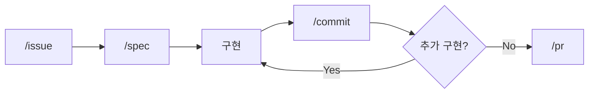
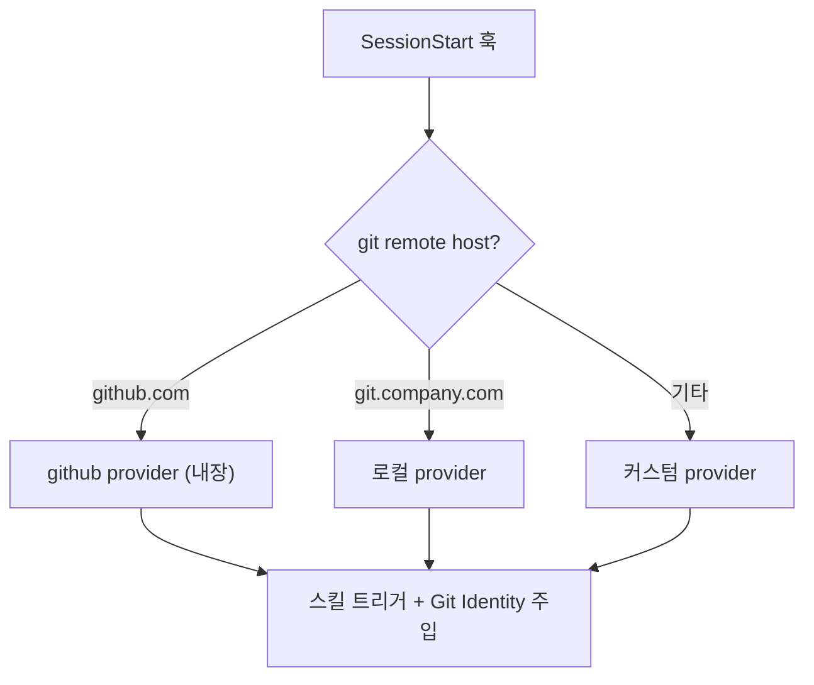

# claude-devex

Claude Code 플러그인 - AI-Native Development Workflow

> 자연어로 요청하면 이슈 생성부터 PR 머지까지 전체 플로우를 안내합니다.
> Provider 시스템으로 GitHub, Dooray 등 다양한 이슈 트래커에 대응합니다.

## 배경

AI에게 코드를 맡기면서 개발자의 역할이 "코드 작성"에서 "의사결정과 검증"으로 옮겨갔습니다.
이 플러그인은 그 변화를 워크플로우로 정착시키기 위해 시작되었습니다.

- [AI에게 코드를 맡기고 나서 달라진 일하는 방식](https://idean3885.github.io/posts/ai-changed-my-workflow/) - 이슈 플로우의 배경
- [코드에서 사고로](https://idean3885.github.io/posts/from-coding-to-thinking/) - thinking 스킬의 배경

## 이슈 플로우



`/flow` 스킬로 전체 플로우를 오케스트레이션할 수 있습니다.
3개의 확인 게이트(플랜 승인, 커밋 승인, 머지 승인)에서 사용자 승인을 받은 후 진행합니다.

| 스킬 | 역할 | 트리거 |
|------|------|--------|
| `/flow` | 이슈 플로우 전체 오케스트레이션 | "flow", "플로우", 자연어 수정 요청 |
| `/issue` | 이슈 생애주기 (create/start/complete) | "이슈", "issue" |
| `/spec` | 요구사항 분석, 아키텍처 설계 | "spec", "명세" |
| `/commit` | 커밋 리뷰 + Git Identity 검증 + 커밋 | "commit", "커밋" |
| `/pr` | PR 생성 + 머지 | "PR", "풀리퀘" |
| `/setup` | provider 등록, 상태 확인 | "setup", "설정" |

## Provider 시스템

이슈 트래커별 동작을 provider로 추상화합니다.
SessionStart 훅에서 git remote host 기반으로 자동 감지됩니다.



| 위치 | 용도 |
|------|------|
| `providers/github.md` | 기본 내장 provider (GitHub) |
| `providers/PROVIDER.md` | 커스텀 provider 작성 템플릿 |
| `~/.claude/devex/providers/` | 로컬 전용 커스텀 provider |
| `~/.claude/devex/overlays/` | host별 오버레이 설정 |

## Git Identity

Provider별 Git Identity(user.name, user.email)를 정의하여,
커밋/푸시 시 올바른 계정으로 자동 설정합니다.

- SessionStart 훅에서 `gh auth status` 크리덴셜과 provider identity를 매칭
- 커밋 전 `git config user.name/email`을 provider 기준으로 자동 검증 및 수정
- 글로벌 git config에 의존하지 않아 계정 오류를 원천 차단

## Thinking 스킬

의사결정과 검증을 구조화하는 사고 도구입니다.
이슈 플로우와 독립적으로 사용하거나 연계할 수 있습니다.

| 스킬 | 역할 | 자연어 예시 |
|------|------|------------|
| `/decision-record` | 아키텍처 의사결정 기록 (MADR 기반, 파기 조건 포함) | "이 결정 기록해줘" |
| `/verify` | 3-Layer 정합성 검증 (Philosophy → Strategy → Tactics) | "이 설계 검증해줘" |
| `/dependency-map` | 의존성 맵 생성, 변경 영향도 분석 (Mermaid) | "의존성 분석해줘" |

## 설치

Claude Code 플러그인 마켓플레이스에서 설치합니다.

```bash
claude plugins add devex@claude-devex --marketplace claude-devex
```

> 마켓플레이스 등록이 필요한 경우:
> ```bash
> claude plugins marketplace add claude-devex --source git --url https://github.com/idean3885/claude-devex.git
> ```

### 플러그인 자체 관리

| 기능 | 동작 |
|------|------|
| git 자동 복원 | SessionStart 훅에서 `.git` 없으면 자동 init + fetch |
| 버전 자동 동기화 | VERSION 파일 ↔ 캐시 디렉토리명 불일치 시 자동 리네임 + installed_plugins.json 갱신 |
| git identity 자동 설정 | 플러그인 리모트 호스트의 provider identity로 자동 설정 |
| 구버전 정리 | 캐시 내 이전 버전 디렉토리 자동 삭제 |

### 로컬 개발

캐시 디렉토리에서 직접 수정 → 커밋 → 푸시.
다음 세션 시작 시 버전 동기화가 자동 수행됩니다.

```bash
cd ~/.claude/plugins/cache/claude-devex/devex/{version}/
# 수정 → git add → git commit → git push origin master:main
```

## 파일 구조

```
claude-devex/
├── README.md                        # 이 파일
├── CLAUDE.md                        # AI 협업 가이드 (범용 템플릿)
├── VERSION                          # 현재 버전 (semver)
├── CHANGELOG.md                     # 변경 이력
├── .claude-plugin/
│   ├── plugin.json                  # 플러그인 메타데이터
│   └── marketplace.json             # 마켓플레이스 등록 정보
├── hooks/
│   └── hooks.json                   # SessionStart 훅 등록
├── scripts/
│   └── session-start.mjs            # provider 감지, Git Identity, 버전 동기화
├── providers/
│   ├── PROVIDER.md                  # 커스텀 provider 템플릿
│   └── github.md                    # GitHub 기본 내장 provider
└── skills/
    ├── issue/SKILL.md               # /issue
    ├── spec/SKILL.md                # /spec
    ├── commit/SKILL.md              # /commit
    ├── pr/SKILL.md                  # /pr
    ├── flow/SKILL.md                # /flow
    ├── setup/SKILL.md               # /setup
    └── thinking/
        ├── decision-record/SKILL.md # /decision-record
        ├── verify/SKILL.md          # /verify
        └── dependency-map/SKILL.md  # /dependency-map
```

## 요구사항

- [Claude Code CLI](https://docs.anthropic.com/en/docs/claude-code)
- [GitHub CLI](https://cli.github.com/) (`gh`)

## 라이선스

MIT
