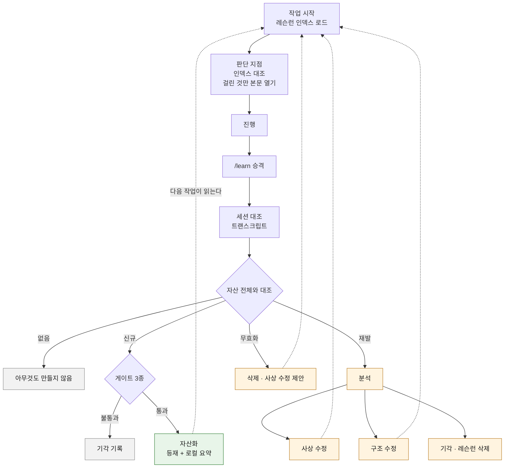

# 레슨런 자산화

작업에서 나온 레슨런을 다음 작업이 읽는 자산으로 남기는 절차다. 규약과 판정 기준만 이 레포에 두고 실제 레슨런은 소비 프로젝트가 자기 스코프에 채운다. 배치는 [PARA 스켈레톤](../templates/para/README.md)의 `areas` 를 쓴다.

## 왜 필요한가

교정은 대화 안에서 소비되고 사라진다. 같은 유형의 오판이 다시 나오면 사람이 다시 잡아야 하고 놓치면 교정 없이 끝난다. 규칙을 늘려도 이 구조는 바뀌지 않는다. 규칙을 추가하는 주체가 사람이면 사람이 알아차린 것만 규칙이 된다.

## 용어

셋만 쓴다.

| 용어 | 뜻 |
|------|-----|
| **레슨런** | 작업에서 얻은 재사용 가능한 판단. 파일 하나 = 레슨런 하나 |
| **참조 사실** | 조사로 확정한 사실. 무엇이 이 값을 만드는가, 어느 경로가 정본인가 |
| **자산화** | 레슨런과 참조 사실을 `areas` 에 등재하고 인덱스를 갱신 |
| **분석** | 재발했을 때 하는 것. 자산이 있었는데 왜 작동하지 않았는지 캔다 |

레슨런과 참조 사실은 **갱신 조건이 다르다.** 레슨런은 판단이라 사실이 바뀌어도 남을 수 있고, 참조 사실은 사실이 바뀌면 그 자리에서 무효가 된다. 그래서 참조 사실에는 확인한 날짜와 확인 방법을 함께 적는다.

| 비교 관점 | 레슨런 | 참조 사실 |
|-----------|--------|-----------|
| 무엇 | 판단 | 사실 |
| 재발 이력 | 있다 | 없다 |
| 필수 | 원본 포인터 | 확인 날짜 · 확인 방법 |
| 무효화 판정 | 근거가 바뀌었는가 | 사실이 바뀌었는가 |

참조 사실을 자산으로 인정하지 않던 동안, 「이 데이터는 저 도구가 만든다」 같은 사실이 남을 자리가 없어 다음 작업에서 같은 조사를 다시 했다.

레슨런은 lessons learned 를 줄인 말이고, 프로젝트 관리 표준이 끝난 일에서 다음 일이 쓸 것만 남길 때 그 항목을 부르는 이름이다. 되짚는 행위인 회고(retrospective)와 갈래가 다르다. 회고는 자리이고 레슨런은 그 자리에서 나온 것이다. 이 문서는 나온 것을 다룬다.

**무엇이 판정 대상인가.** 사용자 교정만이 아니다. **규칙에 없어서 재량으로 정한 자리도 대상이다.** 한 작업에서 선언으로 내려갈 판정 셋이 나왔는데 사람이 손으로 옮겨서 남은 사례가 있다. 옮기지 않았으면 사라졌다.

**언제 하는가.** 세션을 마치기 전이다. `/learn` 이 세션 트랜스크립트 전체를 자산과 대조해 신규·재발·무효화를 판정한다. 자동으로 등재되는 경로는 없다. 사람이 승인한 것만 자산이 되고, 그 이유는 [승격 게이트](#승격-게이트) 에 있다.

## 절차

수집을 작업 완료 단계에 두면 두 곳에서 누락된다. 완료에 도달하지 못한 작업은 통째로 빠지고, 진행 중 기록을 에이전트 자발성에 맡기면 놓친 것이 기록되지 않는다. **놓친 것이 레슨런 대상이므로 그 구조는 성립하지 않는다.** 그래서 대조 대상을 세션 트랜스크립트 전체로 두고, 판단은 승격 시점 한 곳에 모은다.

교정이 0건이면 아무것도 만들지 않는다. 교정이 없던 작업에 빈 레슨런을 쌓으면 자산 총량만 늘고 신호가 묻힌다.

이슈 완료 단계에서 그 기간을 훑는 경로도 같은 대조를 쓴다.

### 로드는 인덱스만, 대조는 판단 지점에서

로드가 자산 전체를 싣지 않는 이유는 상주 비용이다. 인덱스만 컨텍스트에 올리고 본문은 경로로 남긴다. 판단 지점에서 인덱스 전 항목을 훑고 걸린 항목만 본문을 연다. 자산이 늘어도 상주분은 한 줄씩 늘고, 여는 양은 걸린 항목 수를 따른다 ([`config/style-rules/base/authoring.md`](../config/style-rules/base/authoring.md) AU2·AU3).

| 인덱스 상태 | 뜻 |
|-------------|-----|
| 인덱스 N건 | 대조할 자산이 N건 있다 |
| 0건 | 버킷은 있고 자산이 없다는 확인 |
| 버킷 미정의 | 자산의 유무 자체가 확인되지 않았다. 표시하고 통과하되 확인한 것으로 남기지 않는다 |
| 로드 실패 | 버킷은 있는데 인덱스를 읽지 못했다. 대조 자리에 이 상태를 다시 적는다 |

**정본은 실행 단계다.** 위 절차도는 개요이고, 로드·대조·수집을 어느 단계에서 어떤 순서로 하는지는 [`skills/flow/guides/issue.md`](../skills/flow/guides/issue.md) 의 서브커맨드 워크플로우가 정본이다. 둘이 어긋나면 가이드를 사실로 보고 절차도를 고친다.

### 기계가 하는 것과 하지 않는 것

| 단계 | 주체 |
|------|------|
| 세션에서 교정 추리기 | 에이전트 |
| 자산 전체와 대조 (신규·재발·무효화) | 에이전트 |
| 원인 판정·결론 | 에이전트, 근거 제시 |
| 등재·레슨런 삭제·사상 수정 | 사람 승인 |

대조는 의미 비교라 기계가 못 한다. 기계는 트랜스크립트를 넘길 뿐이고 판정은 사람과 에이전트가 한다.

### 정규식으로 교정을 판별하지 않는다

한때 Stop 훅이 사용자 발화에서 교정 신호를 정규식으로 잡아 후보로 적립했다. 설계 전제는
「오탐이 늘어도 승격 단계에서 걸러지니 신호를 넓게 잡는다」였다. 그 전제가 성립하지 않았다.

30일 · 103세션 · 후보 675건으로 측정했다.

| 패턴 세트 | 적립률 | 실제 교정 검출 |
|---|---:|---|
| 넓게 잡은 현행 | 667/675 (99%) | — |
| 교정 형태로 좁힌 안 | 489/675 (72%) | — |
| 가장 좁힌 안 | 8/675 (1%) | 한 세션 교정 6건 중 1건 |

넓히면 전부 걸려 정보가 없고, 좁히면 실제 교정을 놓친다. 사이에 쓸 만한 자리가 없다.
**교정은 직전 산출물과의 관계로 정의되는데 훅은 사용자 발화만 보기 때문이다.** 「우리 자원이
아님」·「뭐가 더 필요합니까?」 둘 다 교정인데 어떤 부정어도 들어 있지 않다.

「걸러진다」도 성립하지 않았다. 거르는 주체가 승격 판정인데 그것이 병목이라, 일 22.5건으로
쌓인 후보가 103세션 동안 한 번도 정리되지 않았다. 오탐이 싼 것은 필터가 돌 때뿐이다.

그래서 훅과 후보 파일을 제거했다. 판정 입력은 세션 트랜스크립트 하나다. 승격 절차가 이미
「후보 0건이어도 세션 대조는 한다」로 트랜스크립트를 판정 근거로 두고 있어, 후보 파일은
쓰이지 않는 입력이었다. 사용자 발화 원문을 평문으로 쌓아 두는 부담도 함께 사라진다.

**다시 만들지 않는다.** 교정 검출을 어휘로 되살리려면 위 표보다 나은 값을 먼저 제시한다.

## 레슨런 파일 규약

한 파일에 한 레슨런. 발생 이력을 누적해 **재발 횟수가 파일 안에서 보이게** 한다. 별도 집계 파일을 두면 두 곳이 어긋난다.

| 기록 항목 | 적는 것 |
|-----------|---------|
| 증상 | 무엇을 잘못했는가. 결과가 아니라 행위 |
| 원인 | 아래 원인 목록 중 하나 |
| 조치 | 무엇을 바꿨는가. 어느 파일·어느 규칙인지까지 |
| 원천 | 답이 이미 있었다면 그 위치 |
| 발생 이력 | 항목마다 **작업 식별자와 날짜**를 함께 적는다. 목록 길이가 재발 횟수 |
| **원본 포인터** | 세션과 트랜스크립트 경로. 요약만 남기지 않는다 |

### 재발 횟수는 발생 이력만 갖는다

**본문 서술·버킷 인덱스·소비 프로젝트 요약에 숫자를 적지 않는다.** 파생 값을 파생 위치에 저장하면 등재 절차를 정확히 지켜도 표면이 어긋난다. 발생 이력은 등재마다 늘지만 요약 세 곳은 각각 손으로 고쳐야 하고, 한 곳을 놓치면 그 값이 낮게 굳는다.

실측에서 한 자산의 재발 횟수가 네 표면에서 전부 달랐다 (이력 17 · 본문 16 · 인덱스 16 · 로컬 인덱스 15). 횟수는 재발 분석의 입력이므로, 낮게 굳은 값을 읽으면 자산의 사상을 고칠 시점을 놓친다.

| 자리 | 적는 것 |
|------|---------|
| 발생 이력 | 항목. 길이가 곧 횟수다 |
| 본문·인덱스·소비 프로젝트 요약 | `최다 재발`·`반복 발생` 같은 서열 표현. 숫자는 적지 않는다 |
| 원인별 횟수 표 | 자산 파일 안, 발생 이력 바로 아래에 둘 때만 허용한다. 어긋나면 같은 화면에서 보인다 |

정확한 값이 필요하면 발생 이력을 센다.

프론트매터 필드 이름과 버킷 경로는 소비 프로젝트가 정한다. 이미 자산 규약을 가진 프로젝트가 그것을 두 벌 갖게 하지 않는다.

원본 포인터가 필수인 이유는 요약이 신호를 잃기 때문이다. 검색 스킬 자기개선 실험의 ablation 에서 원본 트레이스를 받은 개선 제안자가 요약본을 받은 쪽보다 뚜렷하게 나았고, 요약본은 잃은 신호를 복구하지 못했다. 레슨런은 요약이므로 되짚을 경로를 함께 남긴다.

### 발생 이력의 작업 식별자

식별자는 서술의 일부가 아니라 **지표 입력**이다. 「자산화 후 다음 재발까지 걸린 작업 수」가 이 값으로만 계산된다. 날짜와 상황 서술만 적으면 재발 사실은 남고 간격은 사라진다. 그 간격이 자산이 실제로 작동하는지 보는 유일한 눈금이다.

| 상황 | 적는 값 |
|------|---------|
| 이슈·태스크가 있는 작업 | 그 식별자 |
| 트래커 없이 진행한 작업 | 세션 식별자 (`session:<앞 8자리>`) |
| 무엇도 확인하지 못함 | `미확인` |

**작업을 서로 구분하는 값이어야 한다.** 트래커가 없다고 `없음` 같은 공통 값을 적으면 항목끼리 구분되지 않아 사이의 작업 수가 세지지 않는다. 값은 있는데 계산은 안 되는 상태가 되고, 그건 비워 둔 것과 결과가 같다. 세션 식별자는 원본 포인터에 이미 있으므로 새로 만들 필요가 없다.

`미확인` 은 남겨 둔다. 확인하지 않은 것과 트래커가 없는 것은 다르고, 뒤에서 어느 쪽이었는지 되짚어야 한다.

## 승격 게이트

등재는 게이트를 통과한 것만 한다.

| 게이트 | 판정 |
|--------|------|
| 사실 확인 | 원천이 실제로 그 파일·그 위치에 있는가. **그 원천이 최신 사실과 맞는가** |
| 모순 확인 | 기존 레슨런과 충돌하지 않는가 |
| 일반화 확인 | 한 번의 변동을 규칙으로 굳히는 건 아닌가 |

자동 등재를 하지 않는 이유는 검증 없는 자기 학습 루프의 보고된 결과다. 자율 학습 루프의 데이터 품질 분석에서 검증 장치가 없을 때 helpfulness 하락과 model collapse 징후가 나타났다. 자동 캡처를 켜면서 검증을 붙이지 않으면 노이즈가 자산이 된다.

두 번째 게이트에 "원천이 최신 사실과 맞는가" 가 붙은 것은 실제 재발 때문이다. 원천 문서를 열어도 그 문서가 작성 시점 판단을 확인 없이 옮겨 적은 것이면 같은 오판이 나온다. 문서에 적힌 판단은 그때의 것이다.

등재와 로컬 인덱스 요약은 **한 동작**이다. 원격에만 등재하면 다음 판단 시점에 닿지 않는다. 등재 직후 같은 오판이 재발한 사례가 이것을 확인했다.

## 무효화

게이트의 사실 확인은 등재 시점 한 번만 걸린다. 그 뒤로 자산은 다시 검사받지 않는데, 자산이 가리키는 코드·플래그·경로는 계속 움직인다.

**낡은 자산은 없는 것보다 나쁘다.** 자산이 있으면 그것이 확인을 대신하기 때문이다. 값이 틀렸으면 확인을 건너뛴 채로 틀린다. 자산을 늘리는 절차만 있고 줄이는 절차가 없으면 총량이 단조 증가한다. 원인 목록의 "신호가 묻혔다" 가 그 끝이다.

그래서 승격 판정에서 자산을 대조할 때 **지금도 사실인가**를 함께 본다. 별도 주기를 두지 않는 이유는 주기 작업이 밀리기 때문이다. 이미 그 자산을 읽는 자리에서 같이 판정한다.

| 신호 | 결론 |
|------|------|
| 자산이 가리키는 대상이 사라졌다 | 삭제 |
| 근거는 남았으나 결론이 달라졌다 | 사상 수정 |
| 특정 버전·환경에서만 성립하게 됐다 | 적용 범위를 자산에 적는다 |

삭제와 수정도 등재와 같이 사람 승인을 거친다. 판정자가 바로 지우지 않는다.

## 재발 분석

자산이 있는데도 재발했다면 레슨런이 아니라 **레슨런을 전달하는 구조**를 의심한다. 원인은 이 중 하나다.

| 원인 | 확인 방법 |
|------|-----------|
| 로드되지 않았다 | 주입 시점과 판단 시점의 거리 |
| 찾지 못했다 | 인덱스 서술이 실제 검색어와 맞는가 |
| 읽었으나 적용 시점을 놓쳤다 | 읽는 지점과 판단 지점이 같은가 |
| 기록이 틀렸다 | 레슨런 자체의 사실 확인 |
| 신호가 묻혔다 | 자산 총량과 로드 예산 |
| 규칙끼리 충돌해 다른 쪽이 이겼다 | 충돌 쌍 실측 |
| 문제가 아니었다 | 한 번의 변동을 규칙으로 굳혔는가 |
| 고친 층이 낮았다 | 같은 유형이 다른 자리에도 있는가 ([ADR 0004](adr/0004-fix-altitude.md)) |

결론은 셋 중 하나로 낸다.

| 결론 | 뜻 |
|------|-----|
| **사상 수정** | 레슨런 또는 그 상위 전제가 틀렸다. 고쳐 쓴다 |
| **구조 수정** | 판단은 맞았고 전달 경로가 틀렸다. 로드·인덱스·순서를 고치거나, 앞서 고친 층이 낮았으면 층을 올린다 |
| **기각** | 문제가 아니었다. 레슨런을 삭제한다 |

조사 범위는 스킬·훅·provider·규칙 문서 전체다. 같은 유형의 오판이 다른 곳에 잠재해 있는지 봐야 하므로 대상을 손으로 열거하지 않는다. 컨텍스트 비용이 크기 때문에 서브에이전트에 위임하고 결론만 받는다 ([위임 상한](../CLAUDE.md#서브-에이전트-위임-상한)).

## 고칠 층을 먼저 정한다

재발했을 때 가장 빠른 조치는 그 자리에서 고치는 것이다. 차단 규칙을 하나 더하거나, 예외 조건을 하나 두거나, 패턴 항목을 하나 넣는다. 그것을 기본 경로에서 뺐다.

층 선택 규칙은 [ADR 0004](adr/0004-fix-altitude.md) 가 정본이다. 5조와 조별 근거가 거기 있고, 여기서는 재발 분석이 그 규칙을 **어디서 부르는가**를 정한다.

| 시점 | 무엇을 한다 |
|------|-------------|
| 원인 판정 후 | 원인이 「고친 층이 낮았다」면 앞서 한 수정의 층부터 다시 본다 |
| 조치 결정 시 | 사상·규약 → 집행 → 개별 순으로 판정하고, 그 층에서 같은 부류가 닫히는지 묻는다 |
| 같은 조치 2회째 | 층을 올린다 (ADR 0004 5조) |

가드 추가는 집행 층의 조치 하나다. 이 층이 특히 되돌리기 어려워 근거를 따로 남긴다.

- 가드는 증상 하나를 덮는다. 원인이 남아 있으면 다음 증상이 다른 자리에서 나온다
- 가드가 늘면 가드끼리 충돌한다. 원인 목록에 "규칙끼리 충돌해 다른 쪽이 이겼다" 가 있는 이유다
- 오탐이 쌓이면 사람이 가드를 끈다. 그러면 강제 수준이 0 이 된다

같은 이유가 규칙 층에도 걸린다. 규칙은 전역이라 과하면 범위가 더 크다 (ADR 0004 3조).

가드는 분석 결과로만 추가한다. 분석 없이 추가하는 가드는 임시 조치이고 임시 조치의 누적은 되돌리기 어렵다.

## 도구 경계에서 로드한다

원인 「로드되지 않았다」는 자산 내용이 아니라 **읽히는 시점**의 문제다. 세션 시작에 상주하는 것은 인덱스 한 줄뿐이고, 그 줄이 가리키는 시점과 실제 판단 시점이 어긋나면 자산은 있는 채로 작동하지 않는다.

발동 순간에 도구 호출 경계가 있으면 그 자리에 **조치 한 줄만** 주입한다. 표현 규칙이 이미 같은 구조로 돌고 있어 새 기계가 필요하지 않다.

| 하지 않는 것 | 왜 |
|--------------|-----|
| 차단 | 주입까지다. 재발을 차단 규칙 추가로 처리하지 않는다는 규약이 위에 있다 |
| 자산 전문 주입 | 조치 한 줄이고 본문은 경로로 연다 |
| 자리 늘리기 | 「로드되지 않았다」로 두 번 이상 확인된 자산에만 자리를 준다. 자리가 늘면 오탐이 늘고 사람이 통지를 끈다 |

선언은 소비 프로젝트가 한다. 형식과 위치는 [hooks-config.md](hooks-config.md) 에 있다.

**도구 경계가 없는 재발은 이 방법으로 잡히지 않는다.** 응답 본문의 배치 문제가 그렇다. 순서는 정규식으로 판정되지 않으므로 다른 신호를 찾아야 한다.

## 지표

기간별로 추출한다. 이 절차가 스스로 틀렸는지 보는 수단이다.

| 지표 | 무엇을 뜻하는가 | 현재 측정 |
|------|-----------------|-----------|
| 자산화 후 다음 재발까지 걸린 작업 수 | 자산이 실제로 작동하는가 | 미측정 |
| 레슨런 건수 · 재발 건수 | 규모 | 미측정 |
| 기각률 | 높으면 규칙을 과잉 생성하고 있다 | 미측정 |
| 사상 수정 대 구조 수정 비율 | 사상 수정이 계속 나오면 상위 전제가 흔들린다 | 미측정 |
| 가드 증가 대비 재발 감소 | 늘려도 안 줄면 가드가 임시 조치라는 증거 | 미측정 |

값은 비워 둔다. 이 레포는 측정하지 않은 주장을 적지 않는다. 기각률이 이 절차의 자기 점검 지점이다. 레슨런이 많이 기각된다면 문제를 잡는 게 아니라 변동을 규칙으로 굳히고 있다는 뜻이다.

### 이 하나는 측정 방법을 고정한다

나머지는 정의만 두고 방법을 열어 두지만, 이것은 개선 전후를 같은 자로 봐야 하므로 산출을 고정한다.

| 지표 | 산출 | 어디서 | 언제 |
|------|------|--------|------|
| 자산화 후 다음 재발까지 걸린 작업 수 | 자산의 `발생 이력` 두 항목 사이에 완료된 작업 수 | 자산 파일 | 재발 판정 시 |

**판정 시점에 적지 않으면 값이 복구되지 않는다.** 작업 수는 발생 이력의 작업 식별자로만 나온다. 산출식만 두고 입력 필드를 비워 두면 지표는 정의된 채로 영구히 미측정으로 남는다.

교정 수의 단위는 **발화가 아니라 교정**이다. 한 발화에 교정이 둘 담기는 경우가 실제로 나오므로, 발화로 보면 같은 세션이 방식에 따라 다른 값을 낸다.

재발이 아직 없는 자산은 등재 이후 완료 작업 수를 하한으로 적는다. 날짜 간격이 아니라 작업 수로 세는 이유는 쉬는 기간이 값을 부풀리기 때문이다.

## 경계

| 이 레포 | 소비 프로젝트 |
|---------|---------------|
| 용어·절차·파일 규약 | 실제 레슨런 |
| 원인 목록·결론 종류 | 버킷 경로·프론트매터 이름 |
| 지표 정의 | 지표 값 |
| 검출 시점·신호 기본 규칙 | 신호 로컬 확장·인덱스 갱신 |

레슨런에는 판단만 담고 자격·식별자는 담지 않는다. 자산은 오래 남고 열람 범위가 넓어진다.
