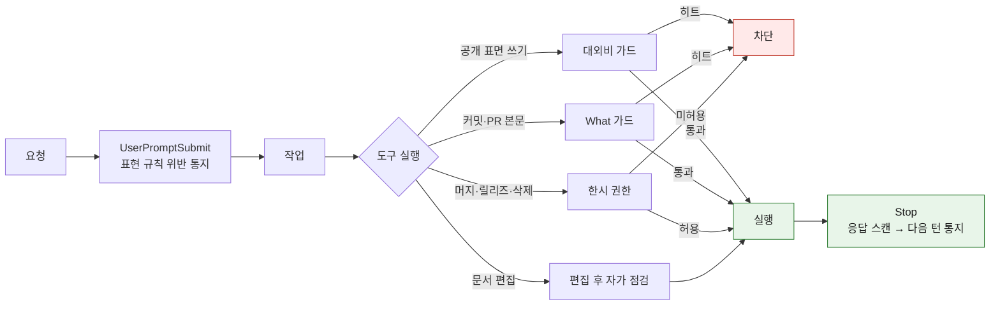

# 설치하고 쓰는 법

무엇이 자동으로 걸리고 무엇을 불러서 쓰는지 적었습니다. 왜 그렇게 만들었는지는 [README](../README.md) 에 있습니다.

## 설치

```bash
claude plugin marketplace add https://github.com/idean3885/claude-ops-agent.git
claude plugin install ops-agent@ops-agent
```

- 마켓플레이스 이름은 레포명이 아니라 `.claude-plugin/marketplace.json` 의 `name` 인 `ops-agent` 입니다
- 세션 시작에 로드되므로 설치 후 새 세션부터 적용됩니다
- 스킬을 직접 호출하지 않아도 됩니다. 자연어로 요청하면 트리거 키워드로 라우팅됩니다

걸렸는지 확인하는 방법입니다.

1. `claude plugin list` 에 `ops-agent@ops-agent` 가 enabled 로 나오는지 확인
2. 세션 시작 메시지에 provider 와 git identity 가 표시되는지 확인
3. "이슈 만들어줘" 라고 하면 `Skill(ops-agent:flow)` 호출이 표시되는지 확인

규칙을 고쳤을 때는 버전을 올려야 반영됩니다. 설치는 버전 단위 스냅샷으로 캐시되므로 파일만 고치면 받는 쪽에 전달되지 않습니다.

```bash
claude plugin marketplace update ops-agent
claude plugin update ops-agent@ops-agent
```

## 설치하면 걸리는 것

호출하지 않아도 동작합니다.

| 시점 | 동작 | 강제 수준 |
|------|------|-----------|
| SessionStart | provider 감지 (git remote host → 트래커 정의) | 자동 적용 |
| SessionStart | git identity 를 provider 기준으로 설정 | 자동 적용 |
| SessionStart | 작성 규칙을 `~/.claude/ops-agent/style-rules/` 로 미러 | 자동 적용 |
| SessionStart | 표현 규칙 목록 주입 (세션 1회) | 자동 적용 |
| SessionStart | 시범 적용 규칙 주입 (`~/.claude/ops-agent/trials.local.json`, 세션 1회, 디렉토리 무관) | 자동 적용 |
| PreToolUse | 대외비 키워드가 공개 표면으로 전송되는 명령 | **실행 전 차단** |
| PreToolUse | 커밋·PR·이슈 본문의 구현 세부 서술 | **실행 전 차단** |
| PreToolUse | 머지·릴리즈·force push·클러스터 변경·리소스 삭제 | **사용자가 세션 허용을 켤 때까지 차단** |
| PreToolUse | 기본 브랜치 직접 push, `reset --hard`·`clean -f`·`branch -D`·`restore` | **사용자가 세션 허용을 켤 때까지 차단** |
| PostToolUse | 문서 편집 후 표현·구조 위반 위치와 수치 | 알림 (마커 파일 있을 때만) |
| PostToolUse | 스킬·지침·provider 문서 편집 시 `authoring`(AU1~AU6) 자가 점검 지시 | 알림 (경로로 읽는 쪽 판정) |
| Stop → 다음 턴 | 직전 응답의 표현 규칙 위반 | 알림 |
| Stop | 사용자 발화의 교정 신호를 레슨런 후보로 적립 | 기록만 (승격은 `/learn`) |

구조 검출은 문단 길이·산문 연속·시각 요소 주기·목록 항목 수·테이블 열 수·헤딩 레벨·코드 언어를 셉니다. 정규식은 어휘만 보므로 산문이 몇 문단 쌓였는지는 따로 세야 알 수 있습니다.

요청부터 응답까지 어디서 막고 어디서 알리는지입니다.



차단 대상과 통과 절차는 [action-gate.md](action-gate.md), 표현 규칙 설정은 [hooks-config.md](hooks-config.md) 에 있습니다.

## 불러서 쓰는 것

자연어 트리거로 진입합니다.

| 스킬 | 역할 | 트리거 |
|------|------|--------|
| `/flow` | 이슈 플로우 단일 진입점 | "flow", "플로우", 자연어 수정 요청 |
| `/org-flow` | 멀티레포 오케스트레이션, 레포별 provider 분기 | "org-flow", "멀티레포" |
| `/setup` | provider 등록, 상태 확인, overlay 설정 | "setup", "설정" |
| `/write` | 글 작성·수정 (계획 → 초고 → 퇴고) | "글 작성", "계획", "초고", "퇴고" |
| `/lint` | 교정. 규칙과 대조해 위반 위치를 찾는다 (AI 티·가독성·톤·구두점) | "교정", "검증", "가독성 검사" |
| `/cross-verify` | 교차 검증 (의사결정·설계·문서·구현) | "교차 검증" |
| `/learn` | 레슨런 후보 검토·승격 ([레슨런 자산화](lessons.md)) | "learn", "레슨런", "레슨 정리", "교훈" |
| `/re-pitch` | 전달되지 않은 답변을 다시 던진다 (요약이 아니라 재설명) | "무슨 말인지 모르겠다", "안 와닿는다", "다시 설명" |
| `/infra-lab` | 클라우드 구성을 만들고 부하를 올려 한계를 관측한 뒤 철거 | "부하 테스트", "인프라 검토", "인프라 설계", "샌드박스" |
| `/cluster-check` | 살아 있는 클러스터를 조회해 판정하고 보고 (읽기만) | "클러스터 점검", "쿠베 체크", "파드 상태", "장애 조사" |
| `/bootstrap` | 스킬이 선언한 외부 의존을 모아 상태 보고. 설치 명령은 건네고 실행은 사용자 | "부트스트랩", "의존 확인", "옵스 업데이트", "플러그인 설치" |

개인 용도로만 쓰는 스킬과 스크립트는 [personal-scope.md](personal-scope.md) 에 따로 적었습니다.

`flow` 하나가 git 상태를 감지해 현재 단계를 실행합니다. 플랜·커밋·머지 세 곳에서 사용자 승인을 받고 진행합니다. 커밋 타입이 체인지로그 분류와 버전 증분을 결정하며(`feat`→`Added`/MINOR, `fix`→`Fixed`/PATCH, `!`·`BREAKING CHANGE:`→MAJOR) 표기는 레포·org 선언이 기본값을 대체합니다.

| 찾는 것 | 정본 |
|---------|------|
| 커밋 단계 규칙 | [skills/flow/guides/commit.md](../skills/flow/guides/commit.md) |
| 선언 위치·해석 순서 | [conventions-slot.md](conventions-slot.md) |
| 이 결정의 배경과 기각한 대안 | [adr/0002-convention-scope-and-ownership.md](adr/0002-convention-scope-and-ownership.md) |
| 작업 강도·컨텍스트 예산 | [effort-policy.md](effort-policy.md) |

## 직접 실행하는 것

스킬로 노출하지 않은 스크립트입니다. 매 세션 시스템 프롬프트를 차지할 만큼 자주 쓰지 않아 스크립트로 뒀습니다.

| 스크립트 | 용도 | 문서 |
|----------|------|------|
| `scripts/worktree-create.sh` | 같은 레포의 여러 PR 을 병렬로 볼 때 워크트리 분기 | [worktree.md](worktree.md) |
| `scripts/bump-version.sh` | 버전 4곳 동시 갱신 | [CONTRIBUTING.md](../CONTRIBUTING.md) |
| `scripts/post-merge-sync.sh` | 머지 후 로컬 캐시 동기 | [CONTRIBUTING.md](../CONTRIBUTING.md) |
| `scripts/action-gate-allow.sh` | 되돌리기 어려운 행위의 세션 허용 토글 | [action-gate.md](action-gate.md) |
| `scripts/pre-merge-check.sh` | 머지 전 버전·CHANGELOG 대조 (검출 시 종료 코드 1) | [action-gate.md](action-gate.md) |
| `scripts/selftest-action-gate.mjs` | 한시 권한 판정·개방 안내 자체 점검 (22건) | [action-gate.md](action-gate.md) |
| `scripts/resolve-manifest.mjs` | 소유자 식별과 org·repo 매니페스트 발견 | [conventions-slot.md](conventions-slot.md) |
| `config/style-rules/metrics/tells_count.py` | AI 티 지표 측정 | [지표 정의](../config/style-rules/metrics/metrics-spec.md) |
| `config/style-rules/metrics/length_stats.py` | 유형별 분량 기준값(행) 측정 | [분량 SSOT](../config/style-rules/base/length.md) |

프로파일을 받는 스크립트는 대상 목록·판정 기준·임계값을 갖지 않고 소비 프로젝트가 공급합니다.

경로는 `~/.claude/ops-agent/current` 로 잡습니다. SessionStart 가 이 링크를 활성 버전으로 유지하므로 갱신해도 명령이 그대로 남습니다.

```bash
bash ~/.claude/ops-agent/current/scripts/action-gate-allow.sh status
```

플러그인 캐시의 버전 디렉토리를 직접 쓰지 않습니다. 이름이 갱신마다 바뀌고 글롭으로 찾으면 자릿수가 다른 버전이 섞였을 때 사전순 정렬이 최신을 집지 못합니다.

## 특화 계층을 채우는 자리

이 레포의 골격을 그대로 쓰고 자기 정의만 채웁니다. 트래커별 동작은 provider 로 추상화되어 있고 SessionStart 훅이 git remote host 로 자동 감지합니다. provider 등록은 `/setup provider`, 커스텀 작성은 [providers/PROVIDER.md](../providers/PROVIDER.md) 를 씁니다.

| 위치 | 용도 |
|------|------|
| `providers/github.md` | 기본 내장 provider |
| `~/.claude/ops-agent/providers/` | 로컬 전용 커스텀 provider |
| `~/.claude/ops-agent/overlays/` | host별 오버레이 설정 |
| `templates/` | 소비 프로젝트용 CLAUDE.md·프로파일·워크플로우 템플릿 |

여러 레포에 걸친 변경은 `/org-flow` 가 통일 브랜치명·레포별 provider·git identity·워크트리를 한 흐름으로 맞춥니다.

## 요구사항

- [Claude Code CLI](https://docs.anthropic.com/en/docs/claude-code)
- [GitHub CLI](https://cli.github.com/) (`gh`)

외부 CLI 인증이 만료되면 스코프 고정·만료·사람이 값을 만지지 않음이라는 세 속성을 기준으로 자격을 고릅니다. 권한 단위 판단, 서비스별 스코프 실측, 정적 토큰을 쓸 때 채울 조건은 [external-auth.md](external-auth.md) 에 정리했습니다.
