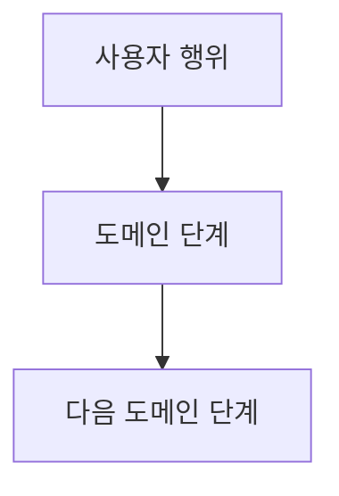

# PR Skill

Pull Request 생성 워크플로우

## 트리거

- "PR", "풀리퀘", "pull request"

## 워크플로우

1. 현재 브랜치 및 변경사항 확인 (git status, git log)
2. 연결할 이슈 번호 확인
3. **타겟 브랜치 결정**: provider의 타겟 브랜치 결정 로직 사용. **반드시 사용자에게 확인** 후 진행
4. PR 본문 작성 (provider의 PR 본문 템플릿 사용)
5. **대외비 가드 (GATE 0)**: PR 제목·본문·코멘트 전체에 [../references/confidential-guard.md](../references/confidential-guard.md) 기준 검증. 히트 시 PR 생성 차단 후 사용자 정정
6. provider의 PR 생성 API/명령 실행
7. PR URL 사용자에게 전달
8. **PR 머지 후 브랜치 정리** (사용자가 머지를 요청한 경우):
   - provider의 머지 API/명령 실행
   - 타겟 브랜치로 이동 및 최신화

## Provider 연동

PR 관련 동작은 provider에 위임한다:

| 항목 | provider에서 참조 |
|------|-------------------|
| PR 생성 API | `Issue Lifecycle > complete` |
| 타겟 브랜치 결정 | `Issue Lifecycle > complete > 타겟 브랜치 결정` |
| PR 본문 템플릿 | `Issue Lifecycle > complete > PR 본문 템플릿` |
| PR 머지 | `Issue Lifecycle > complete > PR 머지 + 정리` |

provider가 감지되지 않으면 기본 내장 provider (`providers/github.md`)를 사용한다.

## 도메인 What 추상화 (필수)

PR 본문은 커밋 본문과 동일한 원칙을 따른다: **도메인 행위·사용자 가치** 만 기술한다. 구현 세부(클래스명·메서드명·어노테이션·yaml 키·파일 경로) 를 나열하지 않는다.

**상세 룰·금지 패턴·좋은 예/나쁜 예·체크리스트는 [commit.md](commit.md#도메인-what-추상화-필수) 참조.**

### PR 본문 권장 구조

```markdown
{이슈 트래커 링크}

## What

{도메인 행위 1~3 단락. 사용자가 보는 행위·상태 변화. 클래스명 없음.}



## 범위 경계

- {본 PR 에 포함되지 않은 항목} → #NNNN
- {다음 단계로 넘어가는 항목} → #MMMM
```

흐름이 단순하면 mermaid 생략 가능. 흐름이 비자명하면 mermaid 가 텍스트 나열보다 우선.

## 규칙

- **공개 표면으로 가는 모든 텍스트는 GATE 0 검증 후 송신** ([../references/confidential-guard.md](../references/confidential-guard.md))
- PR 본문은 도메인 What 추상화 (위 섹션)
- PR 생성은 사용자 승인 후에만
- 타겟 브랜치는 하드코딩하지 않는다 (레포마다 다를 수 있음)
- 이슈 번호가 있으면 provider 방식에 따라 연결
- GitHub 퍼블릭 + GitHub Issues 사용 시: PR 본문에 `Closes #{이슈번호}` 포함 (머지 시 자동 닫힘)
- GHE + 외부 이슈 트래커 사용 시: Closes 키워드 사용하지 않음
- CLAUDE.md 커밋 컨벤션과 PR 제목 형식 일치
