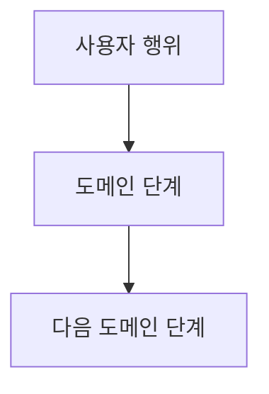

# PR Skill

Pull Request 생성 워크플로우

## 트리거

- "PR", "풀리퀘", "pull request"

## 워크플로우

1. 현재 브랜치 및 변경사항 확인 (git status, git log)
2. 연결할 이슈 번호 확인
3. **타겟 브랜치 결정**: provider의 타겟 브랜치 결정 로직 사용. **반드시 사용자에게 확인** 후 진행
4. PR 본문 작성 (provider의 PR 본문 템플릿 사용)
5. **대외비 가드 (GATE 0)**: PR 제목·본문·코멘트 전체에 [../references/confidential-guard.md](../references/confidential-guard.md) 기준 검증. 히트 시 PR 생성 차단 후 사용자 정정
6. provider의 PR 생성 API/명령 실행
7. PR URL 사용자에게 전달
8. **PR 머지 후 브랜치 정리** (사용자가 머지를 요청한 경우):
   - provider의 머지 API/명령 실행
   - 타겟 브랜치로 이동 및 최신화

## Provider 연동

PR 관련 동작은 provider에 위임한다:

| 항목 | provider에서 참조 |
|------|-------------------|
| PR 생성 API | `Issue Lifecycle > complete` |
| 타겟 브랜치 결정 | `Issue Lifecycle > complete > 타겟 브랜치 결정` |
| PR 본문 템플릿 | `Issue Lifecycle > complete > PR 본문 템플릿` |
| PR 머지 | `Issue Lifecycle > complete > PR 머지 + 정리` |

provider가 감지되지 않으면 기본 내장 provider (`providers/github.md`)를 사용한다.

## 도메인 What 추상화 (필수)

PR 본문은 커밋 본문과 동일한 원칙을 따른다: **도메인 행위·사용자 가치** 만 기술한다. 구현 세부(클래스명·메서드명·어노테이션·yaml 키·파일 경로) 를 나열하지 않는다.

**상세 룰·금지 패턴·좋은 예/나쁜 예·체크리스트는 [commit.md](commit.md#도메인-what-추상화-필수) 참조.**

### PR 제목 규칙 (필수)

- **한 줄에 URL 합치지 않는다**. 이슈 링크는 본문 첫 줄에 분리한다 — GitHub PR 카드·이메일 알림·메신저 미리보기에서 제목이 잘리는 사고 재현 방지.
- 제목은 60 자 내외로 짧게. 풀어쓰기는 본문 What/Why 가 담당한다.

### PR 본문 권장 구조

```markdown
{이슈 트래커 링크}

## What

* 변경 항목 1 (도메인 행위)
* 변경 항목 2
* 변경 항목 3

## Why

* 풀어쓸 배경·결정 사유·트레이드오프 (필요 시)



## 범위 경계

- {본 PR 에 포함되지 않은 항목} → #NNNN
- {다음 단계로 넘어가는 항목} → #MMMM
```

### What / Why 분리 (필수)

- `## What` 은 **bullet (`*`) 요약**. 구어체 풀어쓰기 금지 — 한 눈에 스캔이 안 된다.
- `## Why` 에는 풀어쓸 이야기(배경·결정 사유·트레이드오프·후속 위임)를 담는다. 비어 있으면 섹션 생략.
- What 한 줄은 5~12 단어 도메인 행위. 코드 산출물(클래스명·메서드명) 금지는 [commit.md](commit.md#도메인-what-추상화-필수) 룰 그대로.

흐름이 단순하면 mermaid 생략 가능. 흐름이 비자명하면 mermaid 가 텍스트 나열보다 우선.

### PR 본문 특화 금지 패턴 (필수)

PR 본문은 코드 diff·CI 결과·GitHub 자체 UI 가 이미 보이는 정보를 다시 적지 않는다. 사람이 알아야 할 What/Why 만 남긴다.

| 금지 표 | 이유 (왜 본문에 두면 안 되는가) |
|---------|-----------|
| 변경 파일 목록 표 (영역·파일 경로·diff 라인 수) | 코드 diff·`Files changed` 탭에 이미 표시. 본문 중복 |
| 시그니처 변경 전후 표 (메서드 인자·반환 타입 비교) | 코드 diff 에 직접 표시. 도메인 행위가 아니라 구현 시그니처 |
| 검증 게이트 결과 표 (`compile PASS`, `test N/M PASS`, `lint PASS`) | CI 가 PR 체크로 별도 표시. 본문 자가 검증은 신뢰성 낮음 |
| 헥사고날 계층별 책임 표 (`policy/core`, `policy/adapter` ...) | 코드 구조이지 도메인 What 아님 |
| 응답 필드 신규 표 (필드명·타입·nullable) | spec PR 에서 다루고, 구현 PR 본문은 What 한 줄로 충분 |
| 이전 PR 과 차이 표 (시그니처/필드 비교) | 이전 PR 링크 + What 한 줄 충분. 차이는 코드 diff |

허용 표 (Why 영역, 1~3행 권장):

| 허용 표 | 용도 |
|---------|------|
| 책임 경계 표 (계층별 한 줄) | Why — 왜 이 계층이 이 책임을 가져가는지 |
| 관련 PR/이슈 표 | 참조 — 다중 레포 동시 변경 시 |
| 후속 위임 표 | 범위 경계 — 이번 PR 미포함, 다음 단계 |

### PR 본문 자가 점검 체크리스트 (작성 후 필수)

- [ ] 변경 파일 목록 표가 없다
- [ ] 시그니처 변경 전후 표가 없다
- [ ] 검증 게이트 결과 표가 없다 (compile/test/lint 결과 표시 없음)
- [ ] 헥사고날 계층별 책임 표가 없다
- [ ] What/Why 외 섹션이 없다 (책임 경계·관련 PR·후속 위임만 허용)
- [ ] What 한 줄에 클래스명·메서드명·파일 경로·yaml 키가 없다
- [ ] What/Why 만으로 리뷰어가 "왜·무엇이" 바뀌는지 이해 가능하다

체크리스트의 한 항목이라도 위반이면 본문을 다시 작성한다. 자가 점검 없이 PR 생성 금지.

## 규칙

- **공개 표면으로 가는 모든 텍스트는 GATE 0 검증 후 송신** ([../references/confidential-guard.md](../references/confidential-guard.md))
- PR 본문은 도메인 What 추상화 (위 섹션)
- PR 생성은 사용자 승인 후에만
- 타겟 브랜치는 하드코딩하지 않는다 (레포마다 다를 수 있음)
- 이슈 번호가 있으면 provider 방식에 따라 연결
- GitHub 퍼블릭 + GitHub Issues 사용 시: PR 본문에 `Closes #{이슈번호}` 포함 (머지 시 자동 닫힘)
- GHE + 외부 이슈 트래커 사용 시: Closes 키워드 사용하지 않음
- CLAUDE.md 커밋 컨벤션과 PR 제목 형식 일치
