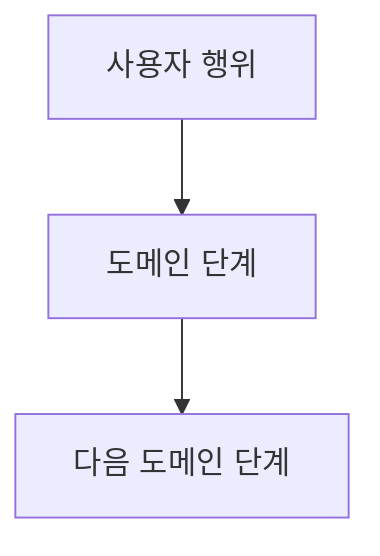

# PR Skill

Pull Request 생성 워크플로우

## 트리거

- "PR", "풀리퀘", "pull request"

## 워크플로우

1. 현재 브랜치 및 변경사항 확인 (git status, git log)
2. 연결할 이슈 번호 확인
3. **타겟 브랜치 결정**: provider의 타겟 브랜치 결정 로직 사용. **반드시 사용자에게 확인** 후 진행
4. **변경분 자체 검증 (GATE 5)**: 아래 [제출 전 변경분 자체 검증](#제출-전-변경분-자체-검증) 을 통과해야 본문 작성으로 넘어간다
5. PR 본문 작성 (provider의 PR 본문 템플릿 사용)
6. **대외비 가드 (GATE 0)**: PR 제목·본문·코멘트 전체에 [../references/confidential-guard.md](../references/confidential-guard.md) 기준 검증. 히트 시 PR 생성 차단 후 사용자 정정
7. provider의 PR 생성 API/명령 실행. **초안으로 연다** (아래 [초안으로 열고 작성자가 먼저 본다](#초안으로-열고-작성자가-먼저-본다))
8. PR URL 사용자에게 전달. 여기서 이 단계는 끝난다 — 리뷰 요청은 보내지 않는다
9. **준비 완료 전환** (사용자가 전환을 요청한 경우): provider의 전환 명령 실행. 리뷰 요청 발송이 이 전환에 붙는다
10. **PR 머지** (사용자가 머지를 요청한 경우):
    - **베이스가 다른 PR 의 브랜치인지 먼저 본다** (아래 [쌓인 PR](#쌓인-pr))
    - **버전 대조 (GATE 6)**: 버전 파일을 두는 레포면 아래 [머지 전 버전 대조](#머지-전-버전-대조) 를 통과해야 머지한다
    - provider의 머지 API/명령 실행
    - 타겟 브랜치로 이동 및 최신화

### 초안으로 열고 작성자가 먼저 본다

PR 은 초안(draft)으로 연다. 열자마자 준비 완료 상태면 그 순간 리뷰어에게 알림이 가고, 작성자가 변경분을 웹에서 보기 전에 리뷰어의 시간이 먼저 쓰인다.

**로컬 diff 로 하는 자체 검증과 다른 단계다.** 앞의 자체 검증은 제출할 내용을 정하고, 이 단계는 제출된 모양을 본다. 렌더된 diff, 파일 단위 접기, 줄 단위 코멘트 자리는 PR 화면에만 있다. 로컬에서 읽고 넘긴 변경분이 화면에서는 다르게 읽히는 자리가 있다.

```bash
gh pr create --draft --base <타겟> --title "<제목>" --body-file <본문파일>
```

**준비 완료 전환은 작성자가 시점을 정한다.** 전환을 자동으로 잇지 않는다. 초안을 만든 직후 전환하면 초안으로 연 이유가 사라진다.

```bash
gh pr ready <PR번호>
```

리뷰 요청 발송은 이 전환에 붙는다. PR 생성에 붙이지 않는다 — 초안 상태로 보낸 요청은 리뷰어가 볼 수 없는 것을 보라는 요청이 된다.

| 단계 | 하는 일 | 누가 시작하나 |
|------|---------|---------------|
| 생성 | 초안 PR 을 열고 URL 을 전달한다 | 어시스턴트 |
| 검토 | 웹에서 변경분을 읽는다 | 작성자 |
| 전환 | 준비 완료로 바꾸고 리뷰 요청을 보낸다 | 작성자가 요청, 어시스턴트가 실행 |

### 제출 전 변경분 자체 검증

**빌드 결과는 이 확인을 대신하지 못한다.** 빌드는 컴파일과 커버리지 임계를 보고 설계 규약 위반은 통과시킨다. 실측에서 의존성 방향 위반과 단위 테스트 부재가 빌드 성공 상태로 제출됐고 리뷰에서야 잡혔다.

기계가 읽을 수 있는 부분은 하네스의 `code-review` 에 맡기고(대상·강도를 인자로 받고 `--comment` 로 인라인 코멘트까지 올린다), 그것이 판정하지 못하는 설계 규약과 노출 경계는 분야 전문가를 부른다. 그 뒤에도 리뷰어의 시간을 쓰기 전에 스스로 변경분을 한 번 읽는 것이 제출 절차의 일부다. 특정 레포의 설계 규약이 아니라 제출이라는 행위에 붙는다. 레포별 스킬에 두면 규약이 적힌 레포에만 걸리고, 정작 규약이 없는 레포에서 같은 실수가 난다.

변경분을 먼저 펼친다. 요약만 보고 판정하지 않는다.

```bash
git diff --stat origin/<타겟>...HEAD
git diff origin/<타겟>...HEAD
```

**출력을 내는 것과 읽는 것은 다른 단계다.** 이 두 명령을 본문 작성·제출 명령과 한 블록에 넣으면 출력이 컨텍스트에 들어오기 전에 다음 명령이 실행된다. 판정하는 명령은 단독으로 돌리고, 결과를 본 뒤 다음 호출로 넘어간다.

| 점검 관점 | 확인할 질문 |
|-----------|-------------|
| 의존성 방향 | 안쪽 계층이 바깥 계층을 참조하게 된 자리가 있는가 (계층 규약을 둔 레포) |
| 테스트 대응 | 새로 만든 공개 동작에 그 단위의 테스트가 있는가 |
| 공개 범위 | 테스트·어댑터를 위해 가시성을 넓힌 자리가 있는가 |
| 남은 참조 | 지우거나 옮긴 것을 가리키는 자리가 남아 있는가 |

레포 고유 규약이 있으면 그 레포의 `CLAUDE.md` 가 항목을 더한다. 이 넷은 규약이 없는 레포에도 걸리는 하한이다.

한 항목이라도 걸리면 고친 뒤 다시 본다. 「리뷰에서 지적받으면 고친다」로 넘기지 않는다. 그 판단은 리뷰어의 시간을 내 확인 시간으로 대신 쓰는 것이다.

### 머지 전 버전 대조

버전 파일을 두는 레포에서, 브랜치가 타겟보다 오래된 베이스 위에 서 있으면 머지가 버전을 **뒤로 밀 수 있다.**

실측 사례에서 브랜치는 타겟이 8.1.1 인 동안 8.0.1 을 담고 있었고, 머지 후 `VERSION` 이 8.0.1 이 되고 CHANGELOG 에 같은 버전 헤더가 둘이 됐다. 갱신 대상이 여러 파일이라 하나가 어긋나면 캐시 경로 해석이 깨진다.

**로컬 값이 아니라 원격 브랜치의 값을 본다.** 이 사고의 원인이 푸시하지 않은 로컬 리베이스였다. 로컬에서 고쳐도 푸시하지 않으면 효과가 없고, 그 상태에서 PR 은 머지 가능으로 보인다.

**git 충돌에 기대지 않는다.** 버전 항목을 파일 앞쪽 고정 지점에 삽입하는 도구를 쓰면, 다른 작업이 같은 값을 고쳐도 삽입 위치가 달라 자동 병합된다.

**막는 것은 뒤로 미는 것 하나다.** 브랜치와 타겟의 버전이 같은 것은 정상으로 본다. 변경을 `Unreleased` 에 쌓고 릴리즈 시점에 끊는 레포는 일반 PR 이 버전을 올리지 않는다. 「같으면 멈춤」으로 두면 그런 레포의 PR 이 전부 막힌다.

```bash
bash ~/.claude/ops-agent/current/scripts/pre-merge-check.sh <브랜치> <타겟>
```

검출하면 **종료 코드 1** 이다. 그래서 머지 명령에 `&&` 로 물려도 된다.

```bash
bash ~/.claude/ops-agent/current/scripts/pre-merge-check.sh <브랜치> <타겟> && gh pr merge <번호> --merge
```

**판정을 출력만 하는 형태로 두지 않는다.** 「멈춤」을 출력해도 같은 블록의 다음 줄은 그대로 실행된다. 실측에서 이 검사가 멈춤 두 줄을 출력한 블록에서 머지가 실행되어 기본 브랜치의 버전이 뒤로 밀렸다. 검사를 종료 코드로 만든 이유이고, 한시 권한이 대상 행위와 다른 명령의 동거를 차단하는 이유다 ([docs/action-gate.md](../../../docs/action-gate.md) 의 「다른 명령과 한 블록에 두지 않는다」).

| 인자·환경변수 | 지정하는 것 |
|---------------|-------------|
| 첫 인자 | 브랜치 (생략 시 현재 브랜치) |
| 둘째 인자 | 타겟 (생략 시 `origin/HEAD`, 없으면 `main`) |
| `VERSION_FILE` | 버전 파일 이름 (기본 `VERSION`). 그 이름의 파일이 없으면 버전 비교를 건너뛴다 |
| `CHANGELOG_FILE` | 체인지로그 파일 이름 (기본 `CHANGELOG.md`) |

멈추면 브랜치를 타겟 위로 다시 올린 뒤 **푸시하고** 다시 대조한다. 원격에 브랜치가 없으면 「파일 없음」이 아니라 멈춤이다. 검사하지 못한 상태를 통과와 같은 모양으로 두지 않는다.

### 쌓인 PR

PR 의 베이스가 기본 브랜치가 아니라 **다른 PR 의 브랜치**이면 순서와 브랜치 삭제 시점이 정해져 있다.

1. 아래 PR 부터 머지한다
2. **그 머지에서는 브랜치를 지우지 않는다**
3. 위 PR 의 베이스가 기본 브랜치로 옮겨진 뒤에 지운다

베이스 브랜치가 사라지면 그것을 베이스로 둔 PR 은 **닫힌다.** 실측 타임라인에서 베이스 삭제 1초 뒤에 닫혔고 리타깃 시도는 없었다.

결함이 아니라 정상 동작이므로 코드로 막을 것이 없다. 대가는 되돌릴 수 없다는 점이다. 닫힌 PR 은 `--base` 변경도 `reopen` 도 거절되고, 같은 브랜치로 PR 을 새로 올려야 하며 번호와 리뷰가 끊긴다.

문서 하나를 두 이슈로 나눠 다루면 쌓인 PR 이 자연스럽게 생긴다. 드문 경우가 아니다.

## Provider 연동

PR 관련 동작은 provider에 위임한다:

| 위임 동작 | provider 참조 위치 |
|-----------|---------------------|
| PR 생성 API | `Issue Lifecycle > complete` |
| 준비 완료 전환 | `Issue Lifecycle > complete > 준비 완료 전환` |
| 타겟 브랜치 결정 | `Issue Lifecycle > complete > 타겟 브랜치 결정` |
| PR 본문 템플릿 | `Issue Lifecycle > complete > PR 본문 템플릿` |
| PR 머지 | `Issue Lifecycle > complete > PR 머지 + 정리` |

provider가 감지되지 않으면 기본 내장 provider (`providers/github.md`)를 사용한다.

## 도메인 What 추상화

PR 본문은 커밋 본문과 동일한 원칙을 따른다: **도메인 행위·사용자 가치** 만 기술한다. 구현 세부(클래스명·메서드명·어노테이션·yaml 키·파일 경로) 를 나열하지 않는다.

**상세 룰·금지 패턴·좋은 예/나쁜 예·체크리스트는 [commit.md](commit.md#도메인-what-추상화-필수) 참조.**

### PR 제목 규칙

- **한 줄에 URL 합치지 않는다**. 이슈 링크는 본문 첫 줄에 분리한다: GitHub PR 카드·이메일 알림·메신저 미리보기에서 제목이 잘리는 사고 재현 방지.
- 제목은 60 자 내외로 짧게. 풀어쓰기는 본문 What/Why 가 담당한다.

### PR 본문 구조

**첫 줄 = 이슈/티켓 링크** (사내 표준 · 최상단 고정, 제목엔 URL 합치지 않음). 이어서 What → Why → 범위 경계 → (선택) **How(최하단)**. 구현 세부는 오직 최하단 How 에만 둔다.

```markdown
{이슈 트래커 링크}   ← 본문 첫 줄 (필수)

## What

* 변경 항목 1 (도메인 행위)
* 변경 항목 2
* 변경 항목 3

## Why

* 풀어쓸 배경·결정 사유·트레이드오프 (필요 시)


```mermaid
flowchart TD
  A[사용자 행위] --> B[도메인 단계]
  B --> C[다음 도메인 단계]
```

## 범위 경계

- {본 PR 에 포함되지 않은 항목} → #NNNN
- {다음 단계로 넘어가는 항목} → #MMMM

## How (선택 · 본문 최하단)

* 구현 접근 요약 (어떻게 했나). 클래스·메서드·yaml 키·파일 경로 등 기법은 오직 여기에만 둔다.
* 표가 아니라 접근 요약 — 변경 파일·시그니처·검증 결과 표는 여기서도 금지.
```

### What / Why 분리

- `## What` 은 **bullet (`*`) 요약**. 구어체 풀어쓰기 금지: 한 눈에 스캔이 안 된다.
- `## Why` 에는 풀어쓸 이야기(배경·결정 사유·트레이드오프·후속 위임)를 담는다. 비어 있으면 섹션 생략.
- What 한 줄은 5~12 단어 도메인 행위. 코드 산출물(클래스명·메서드명) 금지는 [commit.md](commit.md#도메인-what-추상화-필수) 룰 그대로.
- **so-what 테스트**: What 만 읽고 "그래서 무엇이 달라지나" 가 잡혀야 한다. 안 잡히면 기법·과정을 적은 것: 도메인 결과로 다시 쓴다.
- **How 는 What/Why 에 섞지 않는다**. 구현 접근·기법·경로는 최하단 `## How` 로 내린다 (없으면 생략).

흐름이 단순하면 mermaid 생략 가능. 흐름이 비자명하면 mermaid 가 텍스트 나열보다 우선.

### PR 본문 특화 금지 패턴

PR 본문은 코드 diff·CI 결과·GitHub 자체 UI 가 이미 보이는 정보를 다시 적지 않는다. 사람이 알아야 할 What/Why 만 남긴다.

| 금지 표 | 이유 (왜 본문에 두면 안 되는가) |
|---------|-----------|
| 변경 파일 목록 표 (영역·파일 경로·diff 라인 수) | 코드 diff·`Files changed` 탭에 이미 표시. 본문 중복 |
| 시그니처 변경 전후 표 (메서드 인자·반환 타입 비교) | 코드 diff 에 직접 표시. 도메인 행위가 아니라 구현 시그니처 |
| 검증 게이트 결과 표 (`compile PASS`, `test N/M PASS`, `lint PASS`) | CI 가 PR 체크로 별도 표시. 본문 자가 검증은 신뢰성 낮음 |
| 헥사고날 계층별 책임 표 (`policy/core`, `policy/adapter` ...) | 코드 구조이지 도메인 What 아님 |
| 응답 필드 신규 표 (필드명·타입·nullable) | spec PR 에서 다루고, 구현 PR 본문은 What 한 줄로 충분 |
| 이전 PR 과 차이 표 (시그니처/필드 비교) | 이전 PR 링크 + What 한 줄 충분. 차이는 코드 diff |

허용 표 (Why 영역, 1~3행 권장):

| 허용 표 | 용도 |
|---------|------|
| 책임 경계 표 (계층별 한 줄) | Why: 왜 이 계층이 이 책임을 가져가는지 |
| 관련 PR/이슈 표 | 참조: 다중 레포 동시 변경 시 |
| 후속 위임 표 | 범위 경계: 이번 PR 미포함, 다음 단계 |

### PR 본문 자가 점검 체크리스트

- [ ] 변경 파일 목록 표가 없다
- [ ] 시그니처 변경 전후 표가 없다
- [ ] 검증 게이트 결과 표가 없다 (compile/test/lint 결과 표시 없음)
- [ ] 헥사고날 계층별 책임 표가 없다
- [ ] What/Why 외 섹션이 없다 (책임 경계·관련 PR·후속 위임만 허용)
- [ ] What 한 줄에 클래스명·메서드명·파일 경로·yaml 키가 없다
- [ ] What/Why 만으로 리뷰어가 "왜·무엇이" 바뀌는지 이해 가능하다
- [ ] 본문 첫 줄이 이슈/티켓 링크다 (사내 표준 · 최상단)
- [ ] 구현 세부(클래스·메서드·yaml 키·파일 경로·기법)는 최하단 `## How` 에만 있다: What/Why 엔 없다
- [ ] What 만 읽어도 "그래서 무엇을 했나(so-what)" 가 잡힌다

체크리스트의 한 항목이라도 위반이면 본문을 다시 작성한다. 자가 점검 없이 PR 생성 금지.

## 규칙

- **공개 표면으로 가는 모든 텍스트는 GATE 0 검증 후 송신** ([../references/confidential-guard.md](../references/confidential-guard.md))
- PR 본문은 도메인 What 추상화 (위 섹션)
- PR 생성은 사용자 승인 후에만
- PR 은 초안으로 열고, 준비 완료 전환은 작성자가 요청할 때만 한다 (위 [초안으로 열고 작성자가 먼저 본다](#초안으로-열고-작성자가-먼저-본다))
- 리뷰 요청 발송은 준비 완료 전환에 붙는다. PR 생성에 붙이지 않는다
- 베이스가 다른 PR 의 브랜치면 머지에서 브랜치를 지우지 않는다 (위 [쌓인 PR](#쌓인-pr))
- 버전 파일을 두는 레포는 머지 전에 원격 브랜치와 타겟의 버전을 대조한다 (위 [머지 전 버전 대조](#머지-전-버전-대조))
- 제출 전에 변경분을 펼쳐 자체 검증한다. 빌드 성공은 이 확인을 대신하지 못한다 (위 [제출 전 변경분 자체 검증](#제출-전-변경분-자체-검증))
- 타겟 브랜치는 하드코딩하지 않는다 (레포마다 다를 수 있음)
- 이슈 번호가 있으면 provider 방식에 따라 연결
- GitHub 퍼블릭 + GitHub Issues 사용 시: PR 본문에 `Closes #{이슈번호}` 포함 (머지 시 자동 닫힘)
- GHE + 외부 이슈 트래커 사용 시: Closes 키워드 사용하지 않음
- CLAUDE.md 커밋 컨벤션과 PR 제목 형식 일치
